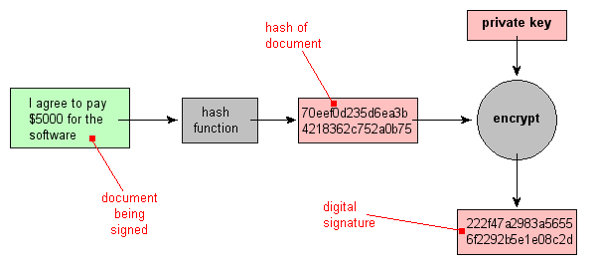

Cryptography: Encryption Algorithms, Hashing and Digital Signatures
===

---
2 Symmetric and Asymmetric Cryptography Overview
---

Modern cryptographic methods use a key to control encryption and decryption 
Two classes of key -based encryption algorithms 
symmetric (secret-key)
asymmetric (public-key) 
Symmetric:
Same key used for both encryption and decryption 
Asymmetric:
Different keys are used for encryption and decryption. 

---
3 Symmetric Cryptography
---

Also known as secret key or private key encryption
Requires sender, receiver know shared secret key
Problem : Key distribution
how to agree on key in first place (particularly if never “met”)?
How to securely transmit the keys ?

---
4 Asymmetric Cryptography
---

Most significant new development in cryptography in the last 300-400 years 
The encryption key is public, decryption key is kept secret (or private)
anyone can encrypt a message but only the one who knows the corresponding private key can decrypt it 

---
5 Symmetric Encryption Methods
---

Symmetric ciphers can be divided into two methods of encryption
 stream ciphers and
 block ciphers 
Stream Cipher
can encrypt a single bit of plaintext at a time 
Block ciphers 
take a number of bits and encrypt them as a single unit 

---
6 Stream Cipher
---

Stream Cipher: Each bit of the data is sequentially encrypted using one bit of the key
Key: a random bit string of length n
Stream ciphers: 
Use Pseudo Random Number Generator
PRNG: {0,1}s  {0,1}n
expand a short (e.g., 128-bit) random seed into a long (e.g., 106 bit) string that “looks random”
Secret key is the seed
Eseed[M] = M  PRNG(seed)

---
7 Stream Cipher
---

---
8 Example
---

Suppose A wishes to send a message M=0110111, and suppose they have previously established a shared secret key:
K =1011011
The cipher text is formed by exclusive-oring the message with the key:
C = M  K = 1101100
Decryption is trivial: the message could be obtained by the same process, i.e. by addition of K to C
M = C K = 0110111

---
9 Fundamental Weaknesses of Stream Ciphers
---

Does not have perfect secrecy
security depends on PRNG
If the same stream is used twice ever, then easy to break.

---
10 Block Cipher
---

Block ciphers encrypt data in chunks of a specific size.
 A block cipher specification identifies 
how much data should be encrypted on each pass (called a block)
what size key should be applied to each block
1-to-1 mapping is used to map k-bit block of plaintext to k-bit block of ciphertext
Example with k=3:

---
11 Block Cipher: Example
---

 plaintext: The only thing we have to fear is fear itself
 plaintext blocks: Theonlyt hingweha vetofear isfearit selfXend
 ciphertext blocks: tylnoehT ahewgnih raefotev tiraefsi dneXfles
 ciphertext: tylnoehTahewgnihraefotevtiraefsidneXfles

5 blocks
Key size: 8 characters in each block

---
12 Block Cipher
---

An initialization vector (IV) is added to the beginning of the data to ensure that all blocks can be properly ciphered. 
The IV is simply a random character string to ensure that two identical messages will not create the same ciphertext.
 To create your first block of ciphertext (CT1), you mathematically combine the crypto key, the first block of data (DB1), and the initialization vector (IV).

--- 
Symmetric encryption algorithms
---

---
14 Popular Symmetric Encryption Algorithms
---

DES
3DES
AES
IDEA
CAST
Rivest
Blowfish
IDEA

---
15 Data Encryption Standard (DES)
---

The Data Encryption Standard (DES) is a symmetric-key block cipher published by the National Institute of Standards and Technology (NIST)
Developed in 1973, adopted as a federal standard in 1976
Widely used symmetric algorithm 
Block cipher
The block size is 64 bits—64 bits of  plaintext gives you 64 bits of ciphertext.
56-bit key length
Performs a substitution and permutation (a form of transposition) based on the key 16 times on every 64 bit block.
While DES has been a common business standard for 20 years, modern computing power has made the key breakable.
Challenge first broken in 1997, took 14000 PCs four months, in 1998 in under a day 

---
16 Data Encryption Standard (DES)
---

---
17 Triple DES (3DES)
---

Triple DES (3DES) is a variant of DES.
Depending on the variant, it uses either two or three keys.
Multiple encryption – goes through the DES algorithm three times.
3DES is stronger than DES but has similar weakness. 
The longer key length makes it more resistant to brute force attacks.
3DES is a good interim step before the new encryption standard, AES.

---
18 Triple DES: 3-DES
---

The major criticism of DES regards its key length. 
This means that we can use double or triple DES to increase the key size.
Triple DES (3DES) is the block cipher, which applies the Data Encryption Standard (DES) cipher algorithm three times to each data block.
Triple DES (3DES) with two keys
		C = EK1(DK2(EK1(P)))

Triple DES (3DES) with three keys
		C = EK3(DK2(EK1(P)))

---
19 3DES (with three different keys)
---

---
20 AES (Rijndael) : Advanced Encryption Standard
---

(Nov. 2001) symmetric-key NIST standard, replacing DES
Designed by Belgian cryptographers Rijmen and Daemen 
processes data in 128 bit blocks
128, 192, or 256 bit keys
brute force decryption (try each key) taking 1 sec on DES, takes 149 trillion years for AES
Can operate over a variable-length block using variable-length keys 
Iterated block cipher 
meaning that the initial input block and cipher key undergoes multiple rounds of transformation before producing the output 

---
21 AES (Advanced Encryption Standard)
---

AES is a block cipher that separates data input into 128-bit blocks. 
Can also be configured to use blocks of 192 or 256 bits.
AES can have key sizes of 128, 192, and 256 bits, with the size of the key affecting the number of rounds used in the algorithm. 
Longer key versions are known as AES-192 and AES-256, respectively.
No efficient attacks currently exist against AES.

---
22 3DES or AES ??
---

---
23 Other secret Key Algorithms
---

CAST
International Data Encryption Algorithm (IDEA) 
DES-like 64-bit block cipher using 128-bit keys 
RC5
 a block-cipher supporting a variety of block sizes, key sizes, and number of encryption passes over the data 
Blowfish
symmetric 64-bit block cipher. Key lengths can vary from 32 to 448 bits in length 
Twofish
128-bit block cipher using 128-, 192-, or 256-bit keys 

---
24 Asymmetric Encryption
---

Asymmetric encryption
RSA
Diffie-Hellman
ElGamal
ECC

---
25 RSA
---

Ron Rivest, Adi Shamir, and Leonard Adleman (RSA)
One of the first public key cryptosystems invented.
Published in 1997
Used for encryption and digital signatures
Uses the product of two very large prime numbers (between 100 and 200 digits long and of equal length)
While a simple algorithm, it has withstood the test of more than 20 years of analysis.
Does not replace symmetric encryption because RSA is 100 times slower than DES!
Asymmetric encryption is used to exchange symmetric keys.

---
26 Diffie-Hellman
---

Created in 1976 by Whitfield Diffie and Martin Hellman
The protocol is one of the most common encryption protocols in use today. 
Used for:
Electronic key exchange method of the Secure Sockets Layer (SSL) protocol
TLS, SSH, and IPsec protocols
Enables the sharing of a secret key between two people who have not contacted each other before.
Diffie-Hellman is still in wide use. 

---
27 Introduction to Hash Functions
---

Hash functions are mathematical computations that take in a relatively arbitrary amount of data as input and produce an output of fixed size. 
The output is always the same when given the same input. 
The inputs to a hash function are typically called messages, and the outputs are often referred to as message digests.

---
28 Example of Hash Function
---

An example of a simple hash function would be the following:
Hash function H accepts messages of any length, and outputs a fixed length digest of one-bit. 
H returns 0 as the message digest if the input has an even number of characters, and returns 1 if the output has an odd number of characters

---
29 Hash Functions Example
---

In the example function, knowing that the output is 1 does not reveal any information about the input other than it has an odd number of digits. 
For example, if an attacker was given the fact that a message has a digest of “1”, the original message could have been “102”, “xqpr3”, or any input of odd length. 
The attacker has no way of determining what the original message was by being given the digest.
 This property makes this hash functions a one-way function, meaning that it is difficult, if not impossible to deduce the input for a given output.

--- 
30 Cryptographic Hash
---

A "hash" (also called a "digest", and informally a "checksum") is a kind of "signature" for a stream of data that represents the contents.
Cryptographic hash functions have another property that most hash functions do not; the property that it is very difficult to find two different messages that produce the same message digest.
Example: md5sum program in UNIX
md5sum program : reads a stream of data and produces a fixed, 128-bit number that summarizes that stream using the popular "MD5" method. 
In the example (see next slide) : the "streams of data" are "files" (two of which we see directly, plus one that's too large to display).

---
31 Cryptographic Hash
---

$ cat smallfile This is a very small file with a few characters
 $ cat bigfile This is a larger file that contains more characters. This demonstrates that no matter how big the input stream is, the generated hash is the same size (but of course, not the same value). If two files have a different hash, they surely contain different data. 
$ ls -l empty-file smallfile bigfile linux-kernel 
-rw-rw-r-- 1 steve steve 0 2004-08-20 08:58 empty-file 
-rw-rw-r-- 1 steve steve 48 2004-08-20 08:48 smallfile 
-rw-rw-r-- 1 steve steve 260 2004-08-20 08:48 bigfile 
-rw-r--r-- 1 root root 1122363 2003-02-27 07:12 linux-kernel 
$ md5sum empty-file smallfile bigfile linux-kernel d41d8cd98f00b204e9800998ecf8427e empty-file 75cdbfeb70a06d42210938da88c42991 smallfile 6e0b7a1676ec0279139b3f39bd65e41a bigfile 
c74c812e4d2839fa9acf0aa0c915e022 linux-kernel
This shows that all input streams yield hashes of the same length

---
32 Cryptographic Hash
---

Avalanche effect: is the term used when even very small changes to the input yields sweeping changes in the value of the hash.
Example:
T -> (in ASCII) 0x54 -> (in Binary) 0 1 0 1 0 1 0 0 
t -> (in ASCII) 0x74 -> (in Binary)  0 1 1 1 0 1 0 0 
This single bit of change in the input produces a very large change in the output: (See difference between file1 and 2 below)
$ cat file1 This is a very small file with a few characters 
$ cat file2 this is a very small file with a few characters
 $ md5sum file?
    75cdbfeb70a06d42210938da88c42991  file1  
    6fbe37f1eea0f802bd792ea885cd03e2    file2

---    
33 Hashing Functions
---

A hashing function is a special mathematical function that performs one-way encryption.
Once the algorithm is processed, there is no feasible way to use the ciphertext to retrieve the plaintext.
There is no feasible way to generate two different plaintexts that compute to the same hash value. 
Two popular hash algorithms are the Secure Hash Algorithm (SHA) series and Message Digest (MD) hash of varying versions (MD2, MD4, MD5).

---
34 Hash Function
---

---
35 Difference between Hashing and  Encryption
---

---
36 Hashing vs. Encryption
---

---
37 Common Uses of Hashing Functions
---

Hashing functions are used to 
Store computer passwords 
Ensure message integrity
Hashing produces a unique value that corresponds to the data entered.
The hash value is also reproducible by anyone else running the same algorithm against the same data. 
This means you can
Create a file.
Get its hash value.
Send the file and the hash to someone.
They can run the file and get its hash value as well.
If the hashes match, the file is in complete tact.

---
38 Hashing passwords
---

---
39 Testing a proposed password against the stored hash
---

---
40 SHA
---

SHA stands for secure hash algorithm.
Refers to four hash algorithms published by the National Institute of Standards and Technology (NIST) and the National Security Agency (NSA).
Federal Information Processing Standards (FIPS) 180-2
Applies compression function to data input.
Accepts up to 264 bits or less and then compresses it down to a smaller number of bits
i.e. – 160 bits for SHA-1

---
41 Block Method
---

Most algorithms use block mode to process data to create the hash.
They break the data into sets of bits (blocks) such as 512.
If a file were 1400 bits long, it would create three blocks with the third one being padded with zeros.
2x512 is 1024, the third block would be 376 bits of the message and 136 bits of zeros. 

---
42 Four Variants of SHA
---

SHA-1, SHA-256, SHA-384, SHA-512
SHA-1 was one of the more secure hash functions.
But it has been found to be vulnerable to a collision attack. 
These longer versions are referred to as SHA-2.
SHA-256, SHA-384, and SHA-512
All have longer hash results, and are more difficult to attack successfully. 
SHA-2 does require more processing power to compute the hash.

---
43 Message Digest
---

Message digest (MD) is the generic version of one of several algorithms that are designed to create a message digest or hash from data input into the algorithm. 
MD algorithms work in the same manner as SHA: 
They use a secure method to compress the file and generate a computed output of a specified number of bits. 
The MD algorithms were all developed by Ronald L. Rivest of MIT.
MD2
MD4
MD5

---
44 MD2 and MD4
---

MD2
Developed in 1989; an early version of MD5 
It takes a data of any length and produces a hash output of 128 bits. 
MD2 is optimized for 8-bit machines.
MD4, MD5 are optimized for 32-bit machines.
MD4
Developed in 1990; optimized for 32-bit computers
It is a fast algorithm, but it is subject to more attacks than more secure algorithms such as MD5.
It has been shown to be vulnerable to collision.
As such, most people use MD5 instead.

---
45 MD5
---

Developed in 1991 and is structured with additional security to overcome the problems in MD4. 
Very similar to the MD4 algorithm, only slightly slower and more secure.
Creates a 128-bit hash of a message of any length and segments the message into 512-bit blocks.

---
46 Digital Signatures
---

Digital signature is a process that guarantees that the contents of a message have not been altered in transit. 
It is touted as the key to truly paperless document flow. 
When you, the server, digitally sign a document, you add a one-way hash (encryption) of the message content using your public and private key pair.
Digital signatures are based on both hashing functions and asymmetric cryptography.
Both encryption methods play an important role in signing digital documents.
Provides integrity and non repudiation

---
47 Nonrepudiation
---

The message sender cannot later deny that they sent the message.
This is important in electronic exchanges of data, especially when you are unable to meet face-to-face.
Nonrepudiation is tied to asymmetric cryptography and cannot be implemented with symmetric algorithms. 

---
48 Digital Signatures
---

Your client can still read it, but the process creates a "signature" that only the server's public key can decrypt. 
The client, using the server's public key, can then validate the sender as well as the integrity of message contents.
Whether it's
an email
an online order
or a watermarked photograph on eBay
If the transmission arrives but the digital signature does not match the public key in the digital certificate, then the client knows that the message has not been altered.

---
49 Example of Digital signature at Client end
---

---
50 Figure 2.7: Simplified Depiction of Essential Elements of Digital Signature (DS) Process
---

 Figure 2.7 is a generic model of the process of making and using digital signatures.
All of the digital signature schemes in FIPS 186-4 have this structure. 

Suppose Bob wants to send a message to Alice. Although it is not important that the message
be kept secret, he wants Alice to be certain that the message is indeed from him.

For this purpose, Bob uses a secure hash function, such as SHA-512, to generate a
hash value for the message. 

That hash value, together with Bob’s private key, serve as input to a digital signature 
generation algorithm that produces a short block that functions as a digital signature. 
Bob sends the message with the signature attached. When Alice receives the message 
plus signature, she:

- (1) calculates a hash value for the message; 
- (2) provides the hash value and Bob’s public key as inputs to a digital signature verification algorithm. If the algorithm returns the result that the signature

is valid, Alice is assured that the message must have been signed by Bob. No one else
 has Bob’s private key, and therefore no one else could have created a signature that
could be verified for this message with Bob’s public key. In addition, it is impossible to
alter the message without access to Bob’s private key, so the message is authenticated
both in terms of source and in terms of data integrity.

The digital signature does not provide confidentiality. That is, the message being
sent is safe from alteration, but not safe from eavesdropping. This is obvious in the
case of a signature based on a portion of the message, because the rest of the message
is transmitted in the clear. Even in the case of complete encryption, there is no
protection of confidentiality because any observer can decrypt the message by using
the sender’s public key.

---
51 Collision Attack
---

A collision attack is used to compromise a hash algorithm.
It occurs when an attacker finds two different messages that hash to the same value. 
This attack is very difficult and requires generating a separate algorithm that attempts to find a text that will hash to the same value of a known hash. 
This must occur faster than simply editing characters until you hash to the same value, which is a brute-force type attack. 
Hash functions that suffers from collisions lose integrity.
An attacker that can make two different inputs hash to the same value, can trick people into running malicious code. 

---
52 Hash Collisions – Hypothetical Example
---

When different chunks of data produce the same hash value, this is known as a collision.

If the hash algorithm is properly designed and distributes the hashes uniformly over the output space, "finding a hash collision" by random guessing is exceedingly unlikely
