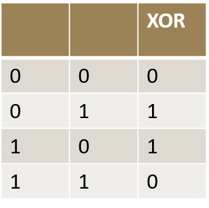

Cryptography: Encryption Algorithms,Hashing and Digital Signatures
===

Created by: Dr. Greetha Sharma
---

---
2 Symmetric and Asymmetric Cryptography Overview
---
Modern cryptographic methods use a key to control encryption and decryption 
Two classes of key -based encryption algorithms 

- symmetric (secret-key)
- asymmetric (public-key) 

Symmetric:

- Same key used for both encryption and decryption 

Asymmetric:

- Different keys are used for encryption and decryption. 

---
3 Symmetric Cryptography
---

Also known as secret key or private key encryption

Requires sender, receiver know shared secret key

Problem : Key distribution

how to agree on key in first place (particularly if never “met”)?

How to securely transmit the keys ?

---
4 Asymmetric Cryptography
---

---
5 Symmetric Encryption Methods
---

---
6 Stream Cipher
---

Stream Cipher: Each bit of the data is sequentially encrypted using one bit of the key

Key: a random bit string of length n

Stream ciphers: 

- Use Pseudo Random Number Generator
- PRNG: {0,1}s -> {0,1}n
  + expand a short (e.g., 128-bit) random seed into a long (e.g., 106 bit) string that “looks random”
- Secret key is the seed
- Eseed[M] = M \* PRNG(seed)

---
8 Example
---

Let + denote the XOR operation 

Suppose A wishes to send a message M=0110111, and suppose they have previously established a shared secret key:

- K =1011011

The cipher text is formed by exclusive-oring the message with the key:

- C = M  K = 1101100

Decryption is trivial: the message could be obtained by the same process, i.e. by addition of K to C

- M = C * K = 0110111
