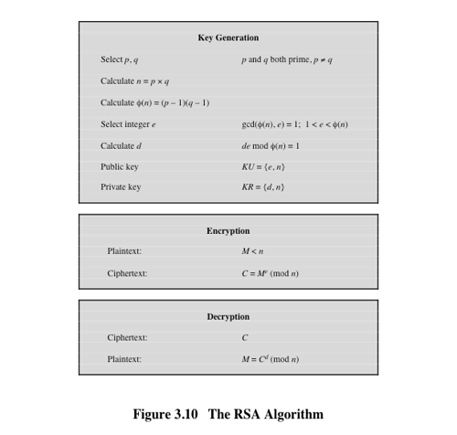
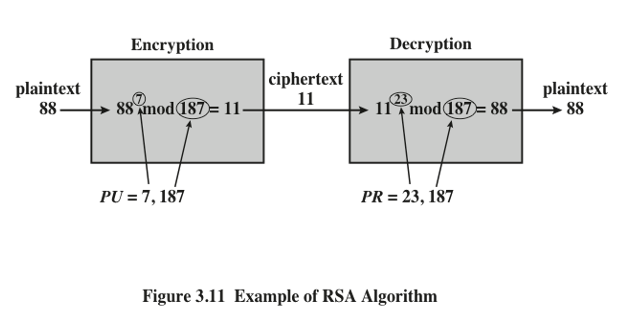
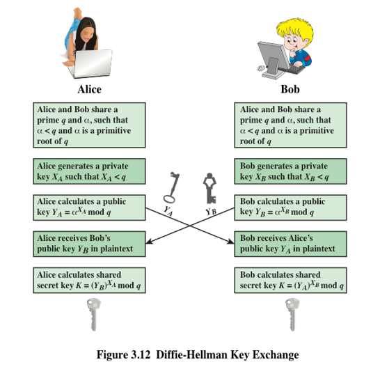

Public-key Cryptography: RSA and Diffie-Hellman Key Exchange Algorithms
===

---
2 RSA Public-Key Encryption Algorithm
---

RSA is a block cipher in which the plaintext and ciphertext are integers between 0 and n -1 for some n.

Encryption and decryption are of the following form for some plaintext block `M` and ciphertext block `C`:

`C = M`e` mod n`

`M = C`d` mod n`

`  = (M`e`)`d` mod n` 

`  = M`ed` mod n`

---
3 RSA Public-Key Encryption Algorithm
---

- Both sender and receiver must know the values of `n` and `e`, and only the receiver knows the value of `d`. 
- This is a public-key encryption algorithm with 
  + a public key of `KU = {e, n}` and 
  + a private key of `KR ={d, n}`

- For this algorithm to be satisfactory for public-key encryption, the following requirements must be met.

1. It is possible to find values of `e`, `d`, `n` such that `M`ed` mod n = M`  for all `M < n`.
2. It is relatively easy to calculate `M`e and `C`d for all values of `M < n`.
3. It is infeasible to determine `d` given `e` and `n`  (can be met for large values of `e` and `n`.)

---
4 RSA Algorithm
---

---
5 Example
---

1. Select two prime numbers, p 17 and q 11.
2. Calculate n = pq = 17 × 11 = 187
3. Calculate $$\phi(n) = (p -1)(q -1) = 16 × 10 = 160 $$
4. Select e such that e is relatively prime to Ø (n) = 160 and less than Ø (n); we choose e = 7.
5. Determine d such that de mod 160 = 1 and d < 160.
The correct value is d 23, because 23 × 7 =161 =(1 × 160) + 1

The resulting keys are public key PU {7, 187} and private key PR {23, 187}.

---
Example: plaintext input of M = 88
---

---
Example: Encryption
---

887 mod 187 [(884 mod 187) × (882 mod 187) × (881 mod 187)] mod 187
881 mod 187 = 88
882 mod 187 =7744 mod 187 = 77
884 mod 187 = 59,969,536 mod 187 =132
887 mod 187 =(88 × 77 × 132) mod 187 =894,432 mod 187 =11

---
Example: Decryption
---

For decryption, we calculate M =1123 mod 187:
1123 mod 187 = [(111 mod 187) × (112 mod 187) × (114 mod 187) ×
(118 mod 187) × (118 mod 187)] mod 187
111 mod 187 =  11
112 mod 187 = 121
114 mod 187 = 14,641 mod 187 = 55
118 mod 187 = 214,358,881 mod 187 = 33
1123 mod 187 = (11 × 121 × 55 × 33 × 33) mod 187
79,720,245 mod 187 = 88

---
Diffie-Hellman Key Exchange
---

The purpose of the algorithm is to enable two users to exchange a secret key securely that then can be used for subsequent encryption of messages. 
The algorithm itself is limited to the exchange of the keys.
The Diffie-Hellman algorithm depends for its effectiveness on the difficulty of computing discrete logarithms.
First, we define a primitive root of a prime number p as one whose powers generate all the integers from 1 to p-1.
if a is a primitive root of the prime number p, then the numbers a mod p, a2 mod p, . . ., ap-1 mod p are distinct and consist of the integers from 1 through p-1 in some permutation
For any integer b less than p and a primitive root a of prime number p, one can find a unique exponent i such that
b = ai mod p ; 0 <= i <= (p 1)
The exponent i is referred to as the discrete logarithm, or index, of b for the base a, mod p.

---
10 Figure 3.12 Diffie-Hellman key Exchange
---

---
11 Example
---

Key exchange is based on the use of the prime number q = 353 and a primitive root of 353, in this case α = 3. 
A and B select secret keys XA = 97 and XB = 233, respectively. 
Each computes its public key:
A computes YA = 397 mod 353 = 40.
B computes YB = 3233 mod 353 = 248.
After they exchange public keys, each can compute the common secret key:
A computes K (YB) XA mod 353 = 24897 mod 353 = 160.
B computes K (YA) XBmod 353 = 40233 mod 353 =160
