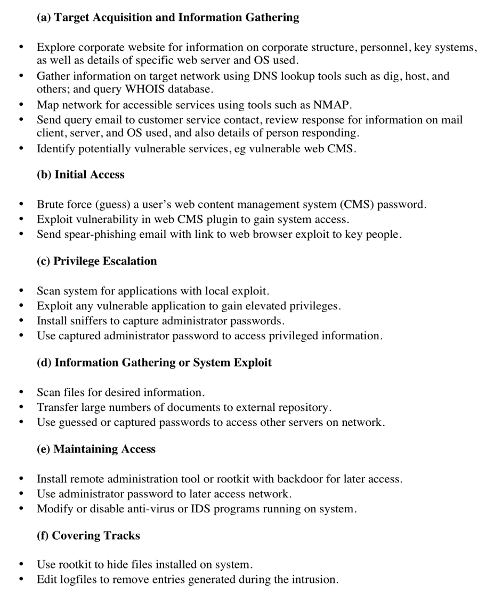
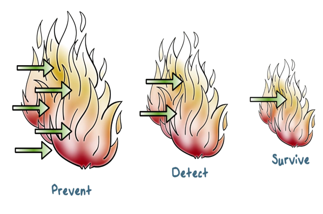
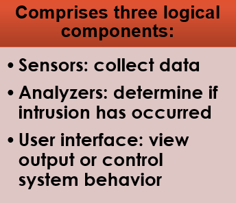

Intrusion Detection Systems
===

---

---
1 Intrusion Detection Systems
---

#### additional slide notes

 Firewalls can be an effective means of protecting a local system or network of systems
from network-based security threats while at the same time affording access to the
outside world via wide area networks and the Internet.

---
2 First Line of Defense: The Firewall
---

- Primary means of securing a private network against penetration from a public network
- An access control device, performing perimeter security by deciding which packets are allowed or denied, and which must be modified before passing
- Core of enterprise’s comprehensive security policy
- Can monitor all traffic entering and leaving the private network, and alert the IT staff to any attempts to circumvent security or patterns of inappropriate use
- Cryptographic measures along with Firewalls (Intrusion Prevention Systems) provide the first line of defense

---
3 Limitations of Intrusion Prevention Systems
---

- Firewall cannot detect security breaches associated with traffic that does not pass through it.
- Not all access to the Internet occurs through the firewall.
- Firewall does not inspect the content of the permitted traffic 
- Cryptographic measures cannot protect against insider attacks

---
4 Insider Attacks
---

- Among the most difficult to detect and prevent
- Can be motivated by revenge or simply a feeling of entitlement
- Example: Kenneth Patterson
  + Disabled the company’s ability to process credit card purchases during five days of the holiday season of 2002

#### additional slide notes

Insider attacks are among the most difficult to detect and prevent.
Employees already have access and knowledge about the structure and content of
corporate databases. Insider attacks can be motivated by revenge or simply a feeling
of entitlement. An example of the former is the case of Kenneth Patterson, fired
from his position as data communications manager for American Eagle Outfitters.
Patterson disabled the company’s ability to process credit card purchases during
five days of the holiday season of 2002. As for a sense of entitlement, there have
always been many employees who felt entitled to take extra office supplies for home
use, but this now extends to corporate data. An example is that of a vice-president
of sales for a stock analysis firm who quit to go to a competitor. Before she left, she
copied the customer database to take with her. The offender reported feeling no
animus toward her former employee; she simply wanted the data because it would
be useful to her.

Although IDS and IPS facilities can be useful in countering insider attacks,
other more direct approaches are of higher priority. Examples include the
following:

•  Enforce least privilege, only allowing access to the resources employees need
to do their job.

•  Set logs to see what users access and what commands they are entering.

•  Protect sensitive resources with strong authentication.

•  Upon termination, delete employee’s computer and network access.

•  Upon termination, make a mirror image of employee’s hard drive before reissuing
it. That evidence might be needed if your company information turns up
at a competitor.

In this section, we look at the techniques used for intrusion. Then we examine
ways to detect intrusion.

---
5 Examples of Intrusion
---

- Remote root compromise
- Web server defacement
- Guessing/cracking passwords
- Copying databases containing credit card numbers
- Viewing sensitive data without authorization
- Running a packet sniffer
- Distributing pirated software
- Using an unsecured modem to access internal network
- Impersonating an executive to get information
- Using an unattended workstation

#### additional slide notes

Intruder attacks range from the benign to the serious. At the benign end of
the scale, there are people who simply wish to explore internets and see what is out
there. At the serious end are individuals or groups that attempt to read privileged
data, perform unauthorized modifications to data, or disrupt systems.

 NIST SP 800-61 (Computer Security Incident Handling Guide , August 2012)
lists the following examples of intrusion:

•  Performing a remote root compromise of an e-mail server

•  Defacing a Web server

•  Guessing and cracking passwords

•  Copying a database containing credit card numbers

•  Viewing sensitive data, including payroll records and medical information,
without authorization

•  Running a packet sniffer on a workstation to capture usernames and passwords

•  Using a permission error on an anonymous FTP server to distribute pirated
software and music files

•  Dialing into an unsecured modem and gaining internal network access

•  Posing as an executive, calling the help desk, resetting the executive’s e-mail
password, and learning the new password

•  Using an unattended, logged-in workstation without permission

 Intrusion detection systems (IDSs) and intrusion prevention systems (IPSs),
of the type described in this chapter and Chapter 9, respectively, are designed to aid
countering these types of threats. They can be reasonably effective against known,
less sophisticated attacks, such as those by activist groups or large-scale email
scams. They are likely less effective against the more sophisticated, targeted attacks
by some criminal or state-sponsored intruders, since these attackers are more likely
to use new, zero-day exploits, and to better obscure their activities on the targeted
system. Hence they need to be part of a defense-in-depth strategy that may also
include encryption of sensitive information, detailed audit trails, strong authentication
and authorization controls, and active management of operating system and
application security.

---
6 Intruder Behavior
---

#### additional slide notes

 The techniques and behavior patterns of intruders are constantly shifting, to exploit
newly discovered weaknesses and to evade detection and countermeasures. However,
intruders typically use steps from a common attack methodology. [VERI16] in their
“Wrap up” section illustrate a typical sequence of actions, starting with a phishing attack
that results in the installation of malware that steals login credentials that eventually
result in the compromise of a Point-of-Sale terminal. They note that while this is one specific
incident scenario, the components are commonly seen in many attacks.
 [MCCL12] discuss in detail activities associated with the following steps:

• Target Acquisition and Information Gathering:  Where the attacker identifies
and characterizes the target systems using publicly available information, both
technical and non-technical, and the use network exploration tools to map target
resources.

 Initial Access: The initial access to a target system, typically by exploiting a
remote network vulnerability as we discuss in Chapters 10 and 11, by guessing
weak authentication credentials used in a remote service as we discussed in
Chapter 3, or via the installation of malware on the system using some form of
social engineering or drive-by-download attack as we discuss in Chapter 6.

•  Privilege Escalation: Actions taken on the system, typically via a local access
vulnerability as discussed in Chapters 10 and 11, to increase the privileges
available to the attacker to enable their desired goals on the target system.

•  Information Gathering or System Exploit: Actions by the attacker to access
or modify information or resources on the system, or to navigate to another
target system.

•  Maintaining Access: Actions such as the installation of backdoors or other
malicious software as we discuss in Chapter 6, or through the addition of covert
authentication credentials or other configuration changes to the system, to
enable continued access by the attacker after the initial attack.

•  Covering Tracks: Where the attacker disables or edits audit logs such as we discuss
in Chapter 18, to remove evidence of attack activity, and uses rootkits and
other measures to hide covertly installed files or code as we discuss in Chapter 6.

---
7 Examples of Intruder Behavior
---

#### additional slide notes

 Table 8.1 lists examples of activities associated with the above steps.

---
8 Defense-in-Depth
---

#### additional slide notes

defense-in-depth principle: we need multiple layers of defense mechanisms. That is, we need detection mechanisms even after we have deployed prevention mechanisms to detect attacks that can’t be easily prevented, or, kept out of our networks and systems.

Typically, these detection mechanisms are called intrusion detection systems.

---
9 Intrusion Detection 
---

IDS – Intrusion Detection Systems
A system’s second line of defense
National Institute of Standards and Technology classifies intrusion detection  as “the process of monitoring the events occurring in a computer system or network and analyzing them for signs of intrusions, defined as attempts to compromise the confidentiality, integrity, availability, or to bypass the security mechanisms of a computer or network".

---
10 Intrusion Detection
---

- Is based on the assumption that the behavior of the intruder differs from that of a legitimate user in ways that can be quantified
- Considerations:
  + If an intrusion is detected quickly enough, the intruder can be identified and ejected from the system before any damage is done or any data are compromised
  + An effective intrusion detection system can serve as a deterrent, so acting to prevent intrusions
  + Intrusion detection enables the collection of information about intrusion techniques that can be used to strengthen the intrusion prevention facility

#### additional slide notes

Inevitably, the best intrusion prevention system will fail. A system’s second line
of defense is intrusion detection, and this has been the focus of much research in
recent years. This interest is motivated by a number of considerations, including the
following:

1.  If an intrusion is detected quickly enough, the intruder can be identified and
ejected from the system before any damage is done or any data are compromised.
Even if the detection is not sufficiently timely to preempt the intruder,
the sooner that the intrusion is detected, the less the amount of damage and
the more quickly that recovery can be achieved.

2.  An effective intrusion detection system can serve as a deterrent, so acting to
prevent intrusions.

3.  Intrusion detection enables the collection of information about intrusion techniques
that can be used to strengthen the intrusion prevention facility.

Intrusion detection is based on the assumption that the behavior of the
intruder differs from that of a legitimate user in ways that can be quantified. Of
course, we cannot expect that there will be a crisp, exact distinction between an
attack by an intruder and the normal use of resources by an authorized user. Rather,
we must expect that there will be some overlap.

---
11 Types of Intrusion detection systems
---

Host-based IDS (HIDS): monitor single host activity
Network-based IDS (NIDS): monitor network traffic
Distributed or hybrid: Combines information from a number of sensors, often both host and network based, in a central analyzer that is able to better identify and respond to intrusion activity

#### additional slide notes

Intrusion detection systems (IDSs) can be classified as follows:
• Host-based IDS: monitors the characteristics of a single host and the events occurring within that host for suspicious activity
• Network-based IDS: monitors network traffic for particular network segments or devices and analyzes network, transport, and application protocols to identify suspicious activity
An IDS comprises three logical components:
• Sensors: Sensors are responsible for collecting data. The input for a sensor may be any part of a system that could contain evidence of an intrusion. Example types of input to a sensor are network packets, log files, and system call traces. Sensors collect and forward this information to the analyzer.
• Analyzers: Analyzers receive input from one or more sensors or from other analyzers. The analyzer is responsible for determining if an intrusion has occurred. The output of this component is an indication that an intrusion has occurred. The output may include evidence supporting the conclusion that an intrusion occurred. The analyzer may provide guidance about what actions to take as a result of the intrusion.
• User interface: The user interface to an IDS enables a user to view output from the system or control the behavior of the system. In some systems, the user interface may equate to a manager, director, or console component.

---
12 IDS Components
---

- Traffic collector / sensor
- Analysis engine
- Signature database
- User interface and reporting 

#### additional slide notes

Exam Tip: Know the differences between host-based and network-based IDSs. A host-based IDS runs on a specific system (server or workstation) and looks at all the activity on that host. A network-based IDS sniffs traffic from the network and sees only activity that occurs on the network. 

Whether it is network- or host-based, an IDS typically consists of several specialized components working together, as illustrated in Figure 13.2. These components are often logical and software-based rather than physical and will vary slightly from vendor to vendor and product to product. Typically, an IDS has the following logical components:
The traffic collector (or sensor) collects activity/events for the IDS to examine. On a HIDS, this could be log files, audit logs, or traffic coming to or leaving a specific system. On a NIDS, this is typically a mechanism for copying traffic off the network link—basically functioning as a sniffer. This component is often referred to as a sensor.
The analysis engine examines the collected network traffic, and compares it to known patterns of suspicious or malicious activity stored in the signature database. The analysis engine is the “brains” of the IDS.
The signature database is a collection of patterns and definitions of known suspicious or malicious activity.
User interface and reporting interfaces with the human element, providing alerts when appropriate and giving the user a means to interact with and operate the IDS.

---
13 IDS Components contd. 
---

- Traffic collector / sensor
  + This component is often referred to as a sensor.
  + The traffic collector (or sensor) collects activity/events for the IDS to examine. 
  + On a HIDS, this could be log files, audit logs, or traffic coming to or leaving a specific system. 
  + On a NIDS, this is typically a mechanism for copying traffic off the network link—basically functioning as a sniffer. 

#### additional slide notes

Know the differences between host-based and network-based IDSs. A host-based IDS runs on a specific system (server or workstation) and looks at all the activity on that host. A network-based IDS sniffs traffic from the network and sees only activity that occurs on the network. 

---
14 IDS Components (continued)
---

---
15 IDS Components
---

- Analysis engine
  + The analysis engine examines the collected network traffic, and compares it to known patterns of suspicious or malicious activity stored in the signature database. 
  + The analysis engine is the “brains” of the IDS.
- Signature database
  + The signature database is a collection of patterns and definitions of known suspicious or malicious activity.
- User interface and reporting 
  + User interface and reporting interfaces with the human element, providing alerts when appropriate and giving the user a means to interact with and operate the IDS.

---
16 Network based IDS  (NIDS)
---

Monitor traffic at selected points on a network (e.g., rlogins to disabled accounts)
In (near) real time to detect intrusion patterns
May examine network, transport and/or application level protocol activity directed toward systems

---
17 Network based IDS  (NIDS) Components
---

---
18 Network based IDS
---

- Advantages of NIDS
  + Providing IDS coverage requires fewer systems.
  + Deployment, maintenance, and upgrade costs are usually lower.
  + A NIDS has visibility into all network traffic and can correlate attacks among multiple systems.
- Disadvantages of NIDS
  + It is ineffective when traffic is encrypted.
  + It can’ t see traffic that does not cross it.
  + It must be able to handle high volumes of traffic.
  + It doesn't know about activity on the hosts themselves.

#### additional slide notes

Security+ objective 2.3a NIDS
Security+ objective 2.4a NIDS

---
19 Host-Based IDS (HIDS)
---

- Examines activity only on a specific host
  + Examines logs, audit trails, and network traffic coming into or leaving the host
  + Examination is done in real time or periodically
- Flags that may raise the alarm in a HIDS
  + Login failures
  + Logins at irregular hours
  + Privilege escalation
  + Additions of new user accounts

#### additional slide notes

(1)Host-Based IDSs
Security+ objective 1.5a HIDS

---
20 How HIDS Work
---

- The traffic collector aggregates information.
- The analysis engine reviews the data.
  + May implement a decision tree to classify activities and make decisions
  + Signature database may be used to match activities to predefined activity or patterns
- Users work with HIDS through the user interface which include the visible components of the HIDS.

---
21 Advantages of HIDS
---

- Can be very operating system-specific
- Can reduce false-positive rates
  + Can examine data after it has been decrypted
  + Can be very application specific
- Can determine how an alarm will impact a system

#### additional slide notes

 (2)Advantages of HIDSs
HIDSs have certain advantages that make them a good choice for certain situations:

They can be very operating system–specific and have more detailed signatures. 
A HIDS can be very specifically designed to run on a certain operating system or to protect certain applications. 

This narrow focus lets developers concentrate on the specific things that affect the specific environment they are trying to protect. With this type of focus, the developers can avoid generic alarms and develop much more specific, detailed signatures to identify malicious traffic more accurately.

They can reduce false-positive rates. When running on a specific system, the HIDS process is much more likely to be able to determine whether or not the activity being examined is malicious. By more accurately identifying which activity is “bad,” the HIDS will generate fewer false positives (alarms generated when the traffic matches a pattern but is not actually malicious).
They can examine data after it has been decrypted. With security concerns constantly on the rise, many developers are starting to encrypt their network communications. When designed and implemented in the right manner, a HIDS will be able to examine traffic that is unreadable to a network-based IDS. 
This particular ability is becoming more important each day as more and more web sites start to encrypt all of their traffic.
They can be very application specific. 
On a host level, the IDS can be designed, modified, or tuned to work very well on specific applications without having to analyze or even hold signatures for other applications that are not running on that particular system. 
Signatures can be built for specific versions of web server software, FTP servers, mail servers, or any other application housed on that host.
They can determine whether or not an alarm may impact that specific system. 
The ability to determine whether or not a particular activity or pattern will really affect the system being protected assists greatly in reducing the number of generated alarms. 
Because the HIDS resides on the system, it can verify things such as patch levels, presence of certain files, and system state when it analyzes traffic. 
By knowing what state the system is in, the HIDS can more accurately determine whether an activity is potentially harmful to the system.

---
22 Disadvantages of HIDS
---

Must process information on every system you want to watch
May have a high cost of ownership and maintenance
Uses local system resources
A focused view and cannot relate to activity around it
If logged locally, could be compromised or disabled

---
23 Types of IDS 
---

Distinguished by detection method:
Signature-based IDS - Relies heavily on a predefined set of attack and traffic patterns called signatures.
Anomaly-based (heuristic) IDS - Monitors activity and attempts to classify it as either “normal” or “anomalous.”

---
24 Analysis Approaches
---

Misuse/ Signature Detection
Uses a set of known malicious data patterns or attack rules that are compared with current behavior
Also known as misuse detection
Can only identify known attacks for which it has patterns or rules

---
25 Misuse or Signature Detection
---

- Detect intrusion by:
  + observing events in the system
  + applying a set of patterns or rules to the data
  + determining if the is intrusive or normal

#### additional slide notes

Signature or heuristic techniques detect intrusion by observing events in the system and applying either a set of signature patterns to the data, to decide whether the observed data indicates intrusive or normal behavior.

---
26 Signature Approaches
---

- Match a large collection of known patternsof malicious data against data stored on asystem or in transit over a network
- The signatures need to be large enough to minimize the false alarm rate, while still detecting a sufficiently large fraction of malicious data

#### additional slide notes

Signature approaches  match a large collection of known patterns of malicious data against data stored on a system or in transit over a network. The signatures need to be large enough to minimize the false alarm rate, while still detecting a sufficiently large fraction of malicious data. This approach is widely used in antivirus products, in network traffic scanning proxies, and in NIDS. 

---
27 Misuse Signature Intruder Detection
---

#### additional slide notes

Here is an example of a misuse detection approach. The IDS matches the observed activities using a set of attack signatures. If there is match, the IDS outputs an alert.

Detect intrusion by:
observing events in the system
applying a set of patterns or rules to the data
determining if the is intrusive or normal

---
28 Signature Approach Advantages & Disadvantages
---

Advantages:
Low cost in time and resource use
Wide Acceptance

Disadvantages:
Significant effort to identify and review new malware to create signatures
inability to detect zero-day attacks

Analysis Approaches
Anomaly Detection:
Involves the collection of data relating to the behavior of legitimate users over a period of time
Current observed behavior is analyzed to determine whether this behavior is that of a legitimate user or that of an intruder

Anomaly Detection Example
Anomaly Detection Advantages & Disadvantages
Advantages:
Able to detect unknown, zero-day attacks

Disadvantages:
High False positives rate
They are generally trained on legitimate data
This limits the effectiveness of some of the techniques discussed. 

IDS principles
Assumption: intruder behavior differs from legitimate users
Expect overlap as shown
    for legit users:
   Observe major deviations
  from past history
Problems of:
false positives
false negatives
must compromise
IDS Evaluation Metrics
False positive: An event, incorrectly identified by the IDS as being an intrusion when none has occurred
False negative: An event that the IDS fails to identify as an intrusion when one has in fact occurred
True Positives : An event the IDS accurately identifies as intrusion
IDS Goals:
Maximize True positives
Minimize false positives, false negatives
Minimize time spent verifying attacks, looking for them

