Dictionaries - Hashtables
===

Created By: [Yusuf Pisan](http://courses.washington.edu/css343/pisan/)
---

formatted to Github Markdown syntax by Ryan Peters

#### Be sure to check the other lectures out after you finish this one! 

<div><a href="https://ryancpeters.github.io/Educational_Resources/343/lecture5/" style="position: relative; left: 5em">Previous lecture </a><a href="https://ryancpeters.github.io/Educational_Resources/343/lecture7/" style="position: relative; left: 20em"><!--- Next lecture--></a></div>

---

#### Table of Contents


1. Dictionaries - Hashtables
2. Dictionaries - Hashtables(2)
3. Typo :-(
4. Anything wrong? - 1
5. Anything wrong? - 2
6. Midterm
7. 2-3 Tree
8. 2-3 Tree - Add
9. 2-3 Tree - Add - split
10. 2-3 Tree - Group Exercise
11. 2-3-4 Trees
12. 2-3-4 Trees
13. 2-3-4 Tree - Group Exercise
14. 2-3-4 Trees == Red-Black Trees
15. Dictionary
16. Implementation
17. Implementation
18. Implementation
19. Implementation Tradeoffs
20. Hashing Functions - Selecting Digits
21. Hashing Functions - Folding
22. Hashing Functions - Modulo Arithmetic
23. Closed Hashing
24. Efficiency
25. Good Hash Function


---
4 Anything wrong? - 1
---


```C
// Add all the elements from the right hand side to the end of the array 
// of this TurtleProgram
TurtleProgram TurtleProgram::operator+= (const TurtleProgram & rhs) {
    *this = *this + rhs;
    return *this;
}

TurtleProgram TurtleProgram::operator+ (const TurtleProgram & rhs) const {
    TurtleProgram newTp;
    for ( int i = 0; i < this->numElements_; i++ )
        newTp.addToEnd( this->commands_[i] );
    for ( int i = 0; i < rhs.numElements_; i++ )
        newTp.addToEnd( rhs.commands_[i] );
    return newTp;
}

```


---
5 Anything wrong? - 2
---


```C
void BinarySearchTree::clear() {
    clearHelper(rootPtr);
}

void BinarySearchTree::clearHelper(BinaryNode<ItemType>* root) {
    // traverse through BST left and right sides
    if (root != NULL) {
        clearHelper(root->getLeftChildPtr());
        clearHelper(root->getRightChildPtr());
        delete root; // to clean up memory leaks
    }
    root = NULL;
}// end of clearHelper

```


---
6 Midterm
---


---
7 2-3 Tree
---

2-node: a node with 2 children
3-node: a node with 3 children

All leaves are at the same level

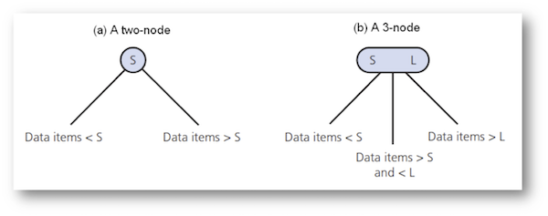

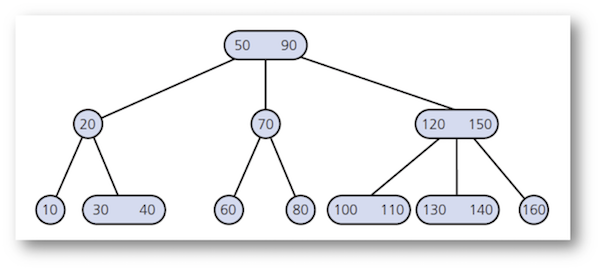


---
8 2-3 Tree - Add
---


If the node does not have room, promote the middle one

Adding 38

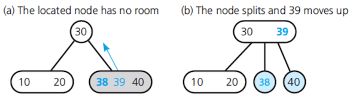


---
9 2-3 Tree - Add - split
---


If the parent does not have enough space, it splits

Adding 36, splitting the 4-child node

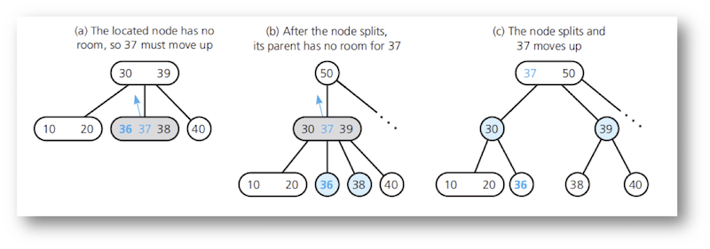


---
10 2-3 Tree - Group Exercise
---


Insert: 50, 100, 20, 30, 40,   
70, 60,  
45, 55, 120,  
65, 67, 68, 35, 52, 31, 32

- Always try to insert to leaf node
- Split rule: promote the middle one

https://www.cs.usfca.edu/~galles/visualization/BTree.html


---
11 2-3-4 Trees
---


- Similar to a 2-3 Tree

- Can have up to 3 values in a node

- Can have up to 4 children (left, middle-left, middle-right, right)

When you find a node with 3 values, promote middle one, split node and then add new value

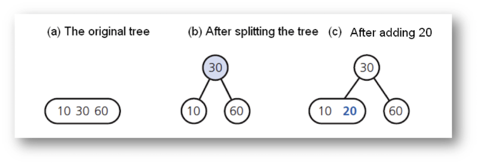

Add 40, 50

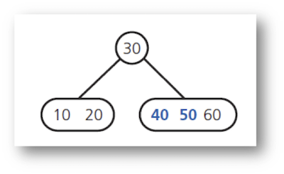

Add 70

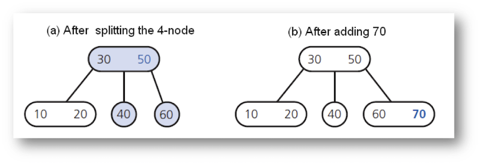


---
12 2-3-4 Trees
---


Add 80

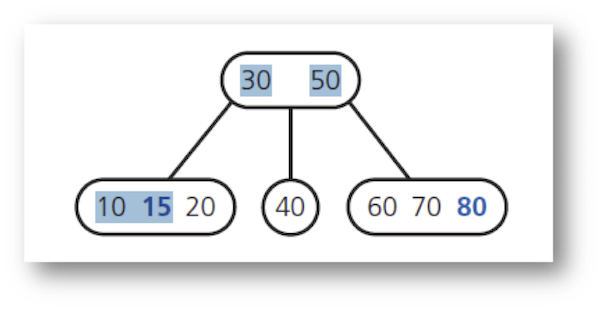

Add 90

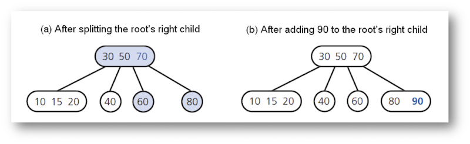


---
13 2-3-4 Tree - Group Exercise
---


Insert: 50, 100, 20, 30, 40,   
70, 60,  
45, 55, 120,  
65, 67, 68, 35, 52, 31, 32

https://www.cs.usfca.edu/~galles/visualization/BTree.html


---
14 2-3-4 Trees == Red-Black Tr
---


Next lecture

Get comfortable with 2-3 Tree


---
15 Dictionary
---


- search key for some data (information about cities, cityName)
- Basic Idea: use a hash function to map the items into positions in an array
- key-value pair
- distinct search keys
- `template<class KeyType, class ValueType>`
- Insert/Delete/Retrieve
    - Average complexity: O(1)
    - Worst-case complexity: O(n)
- Implementation: Linear (Array or Linked-List) based, Binary Search Tree based  
- Two Categories
    - Open hashing (separate chaining)
    - Closed hashing (open addressing) 

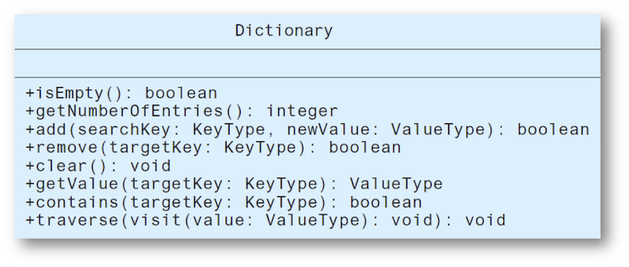


---
16 Implementation
---

- Consider
    - What operations are needed
    - How often each operation is  required
    
A: Mary's sorority is raising money. Each sorority member states their best idea. Mary adds their name and and idea to a dictionary.

> - Search keys don't have to be sorted
> - We know the size, array based more efficient than linked-list


---
17 Implementation
---

B: Dictionary for helping users look up similar words from a thesaurus 

> - Frequent retrieval
> - Add/Delete is very rare
> - Sorted array-based can use binary search (not linked-list)
> - Array or BST


---
18 Implementation
---

C: Maintaining library. Users retrieve from catalog. Library staff adds/deletes items from catalogue.

> - BST best for combined operations


---
19 Implementation Tradeoff
---


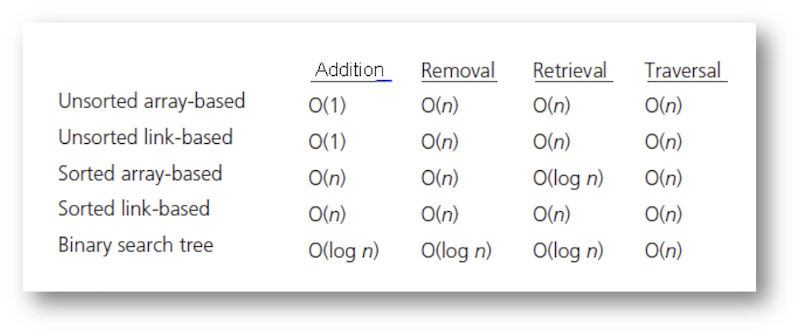


---
20 Hashing Functions - Selecti
---


Selecting digits: Pick 4th land last digit

```
h(426-11-8713) in table[13]
h(518-06-8364) in table[04]
h(352-04-4800) in table[0]
```

But, Social Security Numbers have actual structure

- The first set of three digits is called the Area Number
- The second set of two digits is called the Group Number
- The final set of four digits is the Serial Number


---
21 Hashing Functions - Folding
---

Folding: Add the digits

```
h(426-11-8713) in table[4+2+6+1+1+8+7+1+3]
h(518-06-8364) in table[5+1+8+0+6+8+3+6+4]
h(352-04-4800) in table[3+5+2+0+4+4+8+0+0]
```


---
22 Hashing Functions - Modulo 
---


Modulo Arithmetic: Remainder from a division

`h(x)  = x % 10`

```
h(426-11-8713) in table[3]
h(518-06-8364) in table[4]
h(352-04-4800) in table[0]
```

Group Exercise:
`h(x)  = x % 10, hash 78, 38, 43, 248`

Separate Chaining (also known as Open Hashing): Each bucket stores a linked list of the objects

https://www.cs.usfca.edu/~galles/visualization/OpenHash.html


---
23 Closed Hashing
---


- When a collision occurs, find another bucket

- Probing distance function D(i) to resolve collisions 
      - i: number of collisions in the current attempt
- Next bucket to exam: ( h(x) + D(i) ) mod B
      - B: total # of buckets in a hash table
      - Generally suggested B: prime number and at least 2*expected # of items

- D(i)
    - Linear probing: D(i) = i, check next bucket
    - Quadratic probing: D(i) = i^2^, 
    - Double hashing: D(i) = i*h~2~(x)
    
- Linear probing
    - Causes primary clustering, entries clustered together
    - Removals are problematic, each entry can be occupied, empty, removed
    
- Quadratic probing
    - Causes secondary clustering, entries clustered together, same algorithm
    - Removals are problematic, each entry can be occupied, empty, removed

https://www.cs.usfca.edu/~galles/visualization/ClosedHash.html


---
24 Efficiency
---


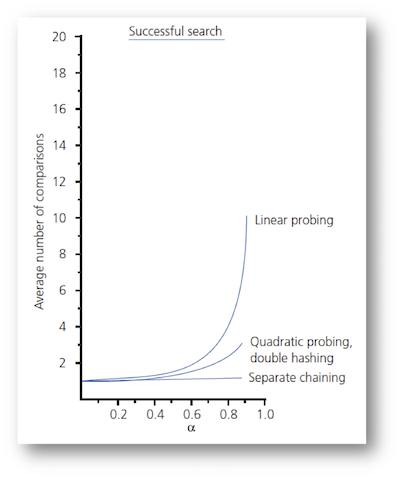 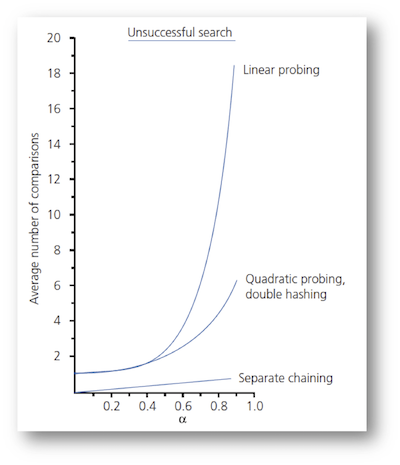


---
25 Good Hash Function
---


- Easy to compute
- Distribute data evenly
- Distribute random/non-random data

- Traversing the dictionary in sorted order is inefficient
