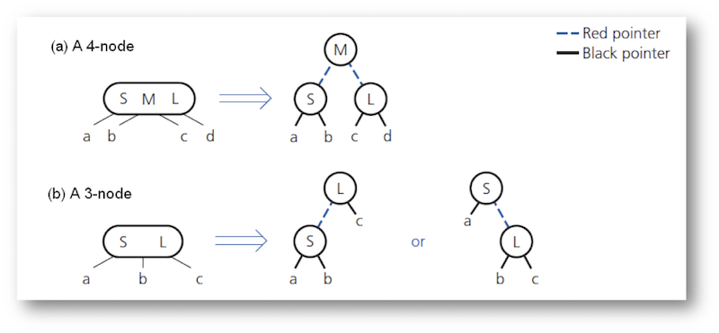

Lecture Feb. 14: Red-Black Trees
===

Created By: [Yusuf Pisan](http://courses.washington.edu/css343/pisan/)
---

formatted to Github Markdown syntax by Ryan Peters

#### Be sure to check the other lectures out after you finish this one! 

<div><a href="https://ryancpeters.github.io/Educational_Resources/343/lecture5/" style="position: relative; left: 5em">Previous lecture </a><a href="https://ryancpeters.github.io/Educational_Resources/343/lecture7/" style="position: relative; left: 20em"><!--- Next lecture--></a></div>

---

#### Table of Contents

1. Red-Black Trees
2. Ass4 Organization
3. Properties
4. Red-Black Tree to the rescue!!!
5. Red-Black Tree Properties
6. Red-Black Tree Addition
7. OO Design - Review
8. Polymorphism - Review
9. Monster and Zombies
10. Multiple inheritance
11. More about design
12. Design Pattern
13. Encapsulation
14. Factory method pattern


---
2 Ass4 Organization
---


+ Groups -- add your group to Canvas

+ If you need a group, respond to poll on slack -- see Pinned items


---
3 Properties
---


+ 2-3-4 tree is balanced

+ Add requires single pass from root to leaf

+ 2-3-4 requires more starage space than BST (nodes can have up to 3 items)

+ BST might be unbalanced


---
4 Red-Black Tree to the res
---

- Idea: Represent each 3-node and 4-node as an equivalent BST

- Let all child pointers of 2-3-4 tree be black

- Use red child pointers to link 2-nodes when 3-node and 4-node are split

- All dictionary operations in O(log n)

- No more than 3 rotations to rebalance.





---
5 Red-Black Tree Properties
---


1. Root is black

2. Every red node has a black parent

3. Any children of red node are black (red node cannot have red children)

4. Every path from root to leaf contains same number of black nodes


Search/Traversal is the same as BST


---
6 Red-Black Tree Addition
---


uncle -- sibling of parent node. Every node is red on insertion

+ Case 0: X is the root. Make X black

+ Case 1: Both parent and uncle are red - push blackness dwon from grandparent
    1. Color the grandparent red
    2. Color the parent black
    3. Color the uncle black
    4. Point X to grandparent

+ Case 2: Parent is red, uncle is black. X and its parent are both left or both right children
    1. Color the grandparent red
    2. Color parent black  
    3. Rotate  
        3a. If both left children, rotate right on parent  
        3b. If both right children, rotate left on parent

+ Case 3: Parent is red, uncle is black. X and its parent are opposite type of children
    1. Need double rotation. 
    2. Rotate  
        2a. If parent is left, child is right, rotate left on parent  
        2b. If parent is right, child is left, rotate right on parent  
    3. Set X to child (which used to be parent) and proceed to Case 2
    
    
    
---
7 OO Design - Review
---


+ UML (Unified Modeling Language)
    + Class
    + “has-a”
        + Aggregation – has owner but doesn’t die with owner (class has-a student)
        + Composition – gone with the owner (cat has-a tail)
        + Multiplicity (multiple associations, student has-a instructor)
    + “is-a” relationship – inheritance  (a cat is a pet)


---
8 Polymorphism - Review
---


If a derived class overrides a base class function, you **MUST** use virtual.

+ Use virtual for the base class function declaration. This is technically necessary.

+ Use override (only) for a derived class' override. This helps maintenance.

+ Pure virtual when the function has to be overriden: `using = 0`

+ Destructors should always be virtual


---
9 Monster and Zombies
---

```c
1	class Monster {
2	public:
3		void attack() {
4			cout << "Grrr ";
5		}
6	};
7
8	class Zombie : public Monster {
9	public:
10		void attack() {
11			cout << "Brainz ";
12		}
13	};
```

Fix the below function

```c
1	void testMonsters() {
2   Monster m;
3		Zombie z;
4
5		m.attack();
6		z->attack();
7
8		Monster * mPtr = new Monster;
9		Zombie * zPtr = new Zombie();
10
11		mPtr.attack;
12		zPtr->attack;
13
14		delete mPtr;
15		delete * zPtr;
13	}

```


---
10 Multiple inheritance
---


https://en.wikipedia.org/wiki/Multiple_inheritance


---
11 More about design
---


+ Traditional noun identification – First try  
    Noun – objects, data  
    Verb - functions

An ATM is an electronic device designed for automatically serving users. A card holder can view balance, deposit, or withdraw money in accounts. Customers interact with the system through a simple interface consisting of a card reader and a numeric keypad …

+ May be refined  
    + Duplicates (users, card holder, customers) -> merge  
    + Get rid of or revisit/revise too big, general, out of scope terms (ATM, electronic device, money, system)  
    + Get rid of “too small” words (balance – attribute?)  
    + Some may be actors (customer)

+ May (optionally) add business logic (manager) class, data structure ADT


---
12 Design Pattern
---


GOF (Gang of Four): Erich Gamma, Richard Helm, Ralph Johnson and John Vlissides 

+ Describes a recurring problem

+ Describes the core of a solution (“essence”)

+ Is capable of generating many distinct designs (sufficiently abstract to be reusable in different contexts)


---
13 Encapsulation
---


+ Hide data – we use it a lot!!

+ Find what varies and encapsulating it “behind” an abstract class


---
14 Factory method pattern
---

https://en.wikipedia.org/wiki/Factory_method_pattern

+ Can be used with an inheritance hierarchy to instantiate the object based on input and return the pointer

+ For the Transaction example:
      + Return a Transaction pointer
      + Can be reused anywhere an object of Transaction needed to be created

+ Related to assignment 4
      + Where can we use factory method? – practice with your design group members  
      + Factory method pattern is preferred but not required


