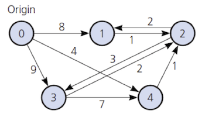
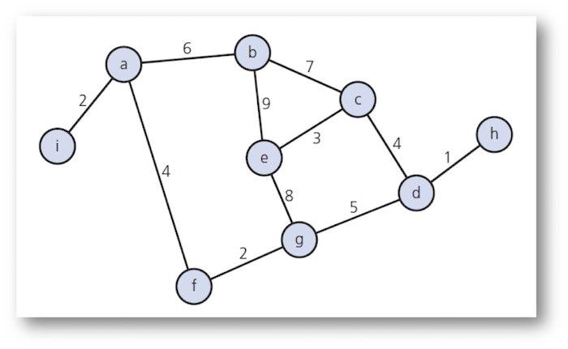

Lecture 5: Graph Algorithms
===

Created By: [Yusuf Pisan](http://courses.washington.edu/css343/pisan/)
---

formatted to Github Markdown syntax by Ryan Peters

#### Be sure to check the other lectures out after you finish this one! 

<div><a href="https://ryancpeters.github.io/Educational_Resources/343/lecture4/" style="position: relative; left: 5em">Previous lecture </a>
  <a href="https://ryancpeters.github.io/Educational_Resources/343/lecture6/" style="position: relative; left: 20em">Next lecture</a></div>


[1]:#lecture-5-graph-algorithms

---

#### Table of Contents
<!-- MarkdownTOC -->
Overview
- [Ass1: Initial Feedback](#ass1-initial-feedback)
- [Ass2: BinarySearchTree](#ass2-binarysearchtree)
- [Graph Algorithms: DFS + BFS](#graph-algorithms-dfs--bfs)
- [Graph Algorithms: Djikstra's Shortest Path](#graph-algorithms-djikstras-shortest-path)
- [Graph Algorithms: Uniform Cost Search \(UCS\)](#graph-algorithms-uniform-cost-search-ucs)
- [Graph Algorithms: A*](#graph-algorithms-a)
- [Topological Sort](#topological-sort)
- [Travelling Salesman Problem \(TSP\)](#travelling-salesman-problem-tsp)
- [xkcd: Travelling Salesman](#xkcd-travelling-salesman)
- [Spanning Trees](#spanning-trees)
- [Prim's Algorithm](#prims-algorithm)
- [Big O](#big-o)
- [Big O \(2\)](#big-o-2)
- [Big O \(3\)](#big-o-3)
- [Big O \(4\)](#big-o-4)
- [Big O \(5\)](#big-o-5)
- [Big O \(6\)](#big-o-6)
- [Big O \(7\)](#big-o-7)
- [Big O \(8\)](#big-o-8)
- [Big O \(9\)](#big-o-9)
- [After Class](#after-class)

<!-- /MarkdownTOC -->


---

### [Overview][1]

<meta name="copyright" content="Yusuf Pisan | pisan@uw.edu | http://courses.washington.edu/css343/" /> <meta name="duration" content="120" />

+ Review: Ass1, Ass2

+ Automated tests on Wednesday & Friday 11pm

+ Graph Algorithms

+ Big O Reading / Exercises


---
Ass1: Initial Feedback
---

- memory leaks
- multiplication is repeated addition, BUT ...
- file names should be lowercase
- output format
- initialize all data members
- indentation
- incorrect friend definition for operator+, operator+=

---
Ass2: BinarySearchTree
---

```C
template<class ItemType>
void BinarySearchTree<ItemType>::inorderTraverse(void visit(ItemType&)) const {
}  // end inorder
```

visit is a function that takes a single argument of ItemType

```C
void itemDisplay(string& anItem) {
    cout << anItem << " ";
}

// bst.inorderTraverse(itemDisplay);
```

---
Graph Algorithms: DFS + BFS
---

+ DFS - Depth-First Search, use stack. 
    - if no unvisited vertices adjacent to the vertex at top of stack, pop stack.
    - else push an unvisited adjacent vertex to stack and mark it as visited

+ BFS - Breadth-First Search, use queue. 
    - dequeue top element
    - mark as visited
    - enqueue all unvisited vertices


Group Exercise: Looking for a path from `e` to `i`. List the order of vertices visited and stack/queue at each iteration

- DFS (best case scenario)
- DFS (worst case scenario)
- BFS

---
Graph Algorithms: Djikstra's Shortest Path
---


To find the shortest path from one vertex to **all** other vertices

```python
// finding shortest-paths from vertex 0
weight[v] = matrix[0][v] for all v
// weight[0] = "-", [1] = 8, [2] = -, [3] = 9, [4] = 4
add v (vertex 0) to vertexSet
while there are still vertices not in vertexset (do this n-2 times)
    Find v with smallest weight v
    Add v to vertexSet
    for all u not in vertexSet
        // if going through the newly selected v will make it shorter
        // set the new weight
        if (weight[u] > weight[v] + matrix[v][u])
            weight[u] = weight[v] + matrix[v][u])
```


Group Exercise: Find the shortest-distance from node-3 to all other nodes. Write out your vertexSet at each step.

---
Graph Algorithms: Uniform Cost Search (UCS)
---

Maintain a priority queue

```C
Insert the root into the queue
While the queue is not empty
      Dequeue the maximum priority element from the queue
      If the path is ending in the goal state
            Print the path and exit
      Else
            Insert all the children of the dequeued element, 
            with the cumulative costs as priority
```




```
Path from 0 to 1

    node = 0
    queue = { {0->4, 4}, {0->1, 8}, {0->3, 9} }

    path = {0->4, 4}
    queue = { {0->4->2, 5}, {0->1, 8}, {0->3, 9} }
    
    path = {0->4->2, 5}
    queue = { {0->4->2->1, 7}, {0->4->2-3, 8}, {0->1, 8}, {0->3, 9} }
    
    path = {0->4->2->1, 7}
    reached goal 1, minimum path cost is 7
```

If all edges have a cost of `1`, UCS is the same as BFS

If the priority is set to the `numberOfNodesInPath`, UCS is the same as DFS

---
Graph Algorithms: A* 
---

Maintain a priority queue with a heuristic

```
f(n) = g(n) + h(n)
g(n) actual cost of getting to node n
h(n) heuristic cost of getting from n to goal
```

The quality of the heuristic determines how much better A* is from UCS

If h(n) is 0, A* is the same as UCS

- Where do we get h(n)? 
    - Straight line distance between given coordinates
    - Manhattan-distance for sliding puzzle
    - Some other domain knowledge

*Admissable* heuristic: Must underestimate, must be less than actual possible cost

- Without heuristics, it is a long long road
    - Rubic's Cube: 10^19^ states
    - 15-puzzle: 10^13^ states


---
Topological Sort
---

Directed graph without cycles has a topological order.

x precedes y if there is a an edge from x to y

142 -> 143 -> 342 -> 343
143 -> 295
143 -> 340 -> 385
143 -> 342 -> 385
132 -> 133
142 -> 173
142 -> 305
142 -> 337
143 -> 340
301 -> 351
301 -> 370
342 -> 421
ENGL 182 -> 301

We cannot represent AND prerequisites (MATH 125 AND CSS 340)

We cannot represent "must be taken concurrently"

For scheduling, we want to generate a topological order

If all pairs of consecutive vertices in the sorted order are connected by edges, then the edges form a **Hamiltonian path**

Exercise: Draw a square without lifting pen, draw a house, ...

---
Travelling Salesman Problem (TSP)
---

Given a set of cities and distance between every pair of cities, the problem is to find the shortest possible route that visits every city exactly once and returns to the starting point. 


Paths: ABCDE, ABCED, ABDCE, ABDEC, .

Complexity: O(n-1)! based on the number of paths

but we can do better with dynamic programming

For a set of size n, we consider n-2 subsets each of size n-1 such that all subsets don’t have nth in them.

There are at most O(n * 2^n^) subproblems, and each one takes linear time to solve

The total running time is therefore O(n^2^ * 2^n^)

https://www.geeksforgeeks.org/travelling-salesman-problem-set-1/

---
xkcd: Travelling Salesman
---


https://xkcd.com/399/


---
Spanning Trees
---

A tree is a psecial kind of undirected graph, connected but no cycles

- A spanning tree is a subgraph of G that contains all of G's vertices and enough of its edges to form a tree
    - n vertices needs at least n - 1 edges to connect them all
    - n vertices with exactly n - 1 edges cannot contain cycles
    - n vertices with more than n - 1 edges must have a cycle
    
Depth-First search spanning tree: Traverse the tree marking edges. When DFS ternminates, the marked edges make up a spanning tree

Breadth-First search spanning tree: Traverse the tree marking edges. When BFS ternminates, the marked edges make up a spanning tree

Minimum spanning tree: A spanning tree that where the sum of the edges is minimal
    - Ethernet line to all the outlets in your home with minimal cabling



Group Exercise: Construct DFS, BFS and minimum spanning tree (starting from `e` for DFS and BFS)

---
Prim's Algorithm
---


```
Start at any vertex, r
mark r as visited
while (there are unvisited vertices)
    find the least-cost edge (v, u) from some visited vertex v to u
    mark u as visited
    Add the vertex u and the edge (v, u) to minimum spanning tree
```

---
Big O
---


28 Examples from "Cracking The Coding Interview"

- Recursive version of fibonacci
- Recursive version of fibonacci4 where it is the sum of last 4 numbers, not 2
- Printing all fibonacci numbers up to n using recursive version of fibonacci

> - O(2^n^) for recursive fibonacci

> - O(2^n^) for fibonacci4 O(4^n^) is still O(2^n^)

> - Sum of 2^1^ +  2^2^ +  2^13^ +  2^4^ +  ... +  2^n^ for printing

> -  O(2^n+1^) is still O(2^n^)

---
Big O (2)
---

- B1: You say your birthday, and ask whether anyone in the room has the same birthday. If anyone does have the same birthday, they answer yes.

- B2: You tell the first person your birthday, and ask if they have the same birthday; if they say no, you tell the second person your birthday and ask whether they have the same birthday; etc, for each person in the room.

- B3: You only ask questions of person 1, who only asks questions of person 2, who only asks questions of person 3, etc. You tell person 1 your birthday, and ask if they have the same birthday; if they say no, you ask them to find out about person 2. Person 1 asks person 2 and tells you the answer. If it is no, you ask person 1 to find out about person 3. Person 1 asks person 2 to find out about person 3, etc.

How many questions will be asked?
 
> - B1: constant time, you only ask 1 question, O(1)
> - B2: linear time, nobody has your birthday, you ask everybody, O(n)
> - B3: The number of questions is 1 + 2 + 3 + ... + N-1 + N, quadratic time, O(n^2^)

---
Big O (3)
---

```
Two loops in a row:
for (i = 0; i < N; i++) {
    sequence of statements
}
for (j = 0; j < M; j++) {
    sequence of statements
}

A nested loop followed by a non-nested loop:
for (i = 0; i < N; i++) {
    for (j = 0; j < N; j++) {
        sequence of statements
    }
}
for (k = 0; k < N; k++) {
    sequence of statements
}
A nested loop in which the number of times the inner loop executes depends on the value of the outer loop index:
for (i = 0; i < N; i++) {
    for (j = N; j > i; j--) {
        sequence of statements
    }
}

// nested loop is n*n
for	(int	i	=	0;	i	<	n;	i++)	{
		for	(int	j	=	0;	j	<	n*n;	j++)	{
				cout	<<	“tricky!”	<<	endl;
		}
}
```

> - O(nm)
> - O(n^2^)
> - O(n^2^)
> - O(n^3^)

---
Big O (4)
---

```
f takes constant time, g takes time linear based on the value of its parameter.

1. for (j = 0; j < N; j++) f(j);

2. for (j = 0; j < N; j++) g(j);

3. for (j = 0; j < N; j++) g(k);

```

> - O(n)
> - O(n^2^), 1 + 2 + 3 ... N - 1
> - O(n * k), we don't now the relative size of k

---
Big O (5)
---

Dynamicc programming stores and reuses results

RE-writing fibonacci, so it is not recurive.

What is the complexity?

---
Big O (6)
---

Knapsack problem: Objects with given size and value, maximize value taht can be stored in capacity C

- Naive approach: Trying all possible combinations

> - 2^n^ possible combinations

---
Big O (7)
---

- V(k, A) - maximum value choosing among the first k objects in a knapsack of capacity A

- V(k, A) = max { V(k-1, A), V(k-1, A-s~k~)+v~k~ }
    - For the next object k, we can either leave it out
    - OR, put it in and reduce the capacity of the knapsack to A-s~k~
    
- Store V values in an array with n+1 rows and C columns: V(0, 0), V(0, 1), V(0, 2), ... next row V(1, 0), V(1, 1), ...

- Each partial solution takes constant time to compute

- Complexity is O(nC)

- Solution is the bottom-right of the arrray V(n, C)

- To find which objects are included, need to keep a separate table of size n * C


---
Big O (8)
---

Shortest Path: Djikstra's algorithm to find shortest path for all nodes

To find the shortest path from one vertex to **all** other vertices

```C
// finding shortest-paths from vertex 0
weight[v] = matrix[0][v] for all v
// weight[0] = "-", [1] = 8, [2] = -, [3] = 9, [4] = 4
add v (vertex 0) to vertexSet
while there are still vertices not in vertexset (do this n-2 times)
    Find v with smallest weight v
    Add v to vertexSet
    for all u not in vertexSet
        // if going through the newly selected v will make it shorter
        // set the new weight
        if (weight[u] > weight[v] + matrix[v][u])
            weight[u] = weight[v] + matrix[v][u])
```

>- Complexity: O(n^2^)


---
Big O (9)
---

Sort each tring in an array and then sort the array (Example 8 from Cracking)

> - Not O(N * NlogN)

> - Length of strings and length of array should not be both N

> - O(s log s) to sort a string, O(a * s log s) to sort each string in array

> - Each string comparison takes O(s) time, there are O(a log a) comparisons

> - Sorting the array takes O(s * a log a)

> - Adding it all up: O(a * s(log a + log s))


---
After Class
---

+ Work on Ass2

+ Review Chapter 20

+ Read Resources: Cracking the Coding Interview - VI Big O

