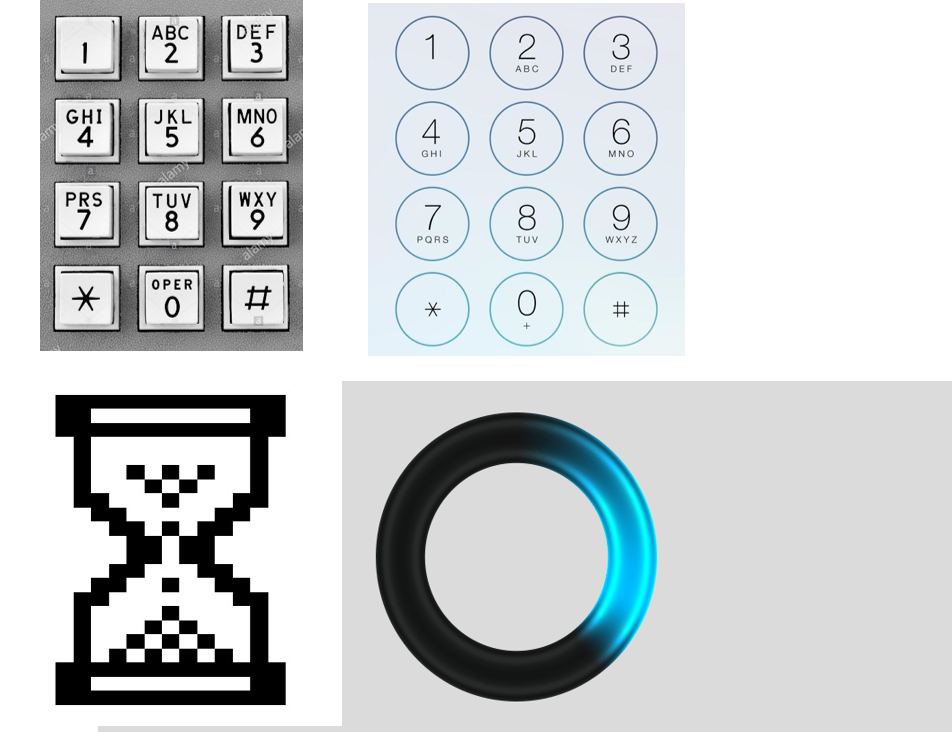
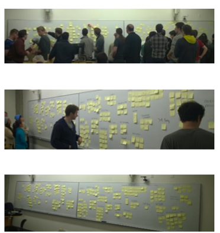
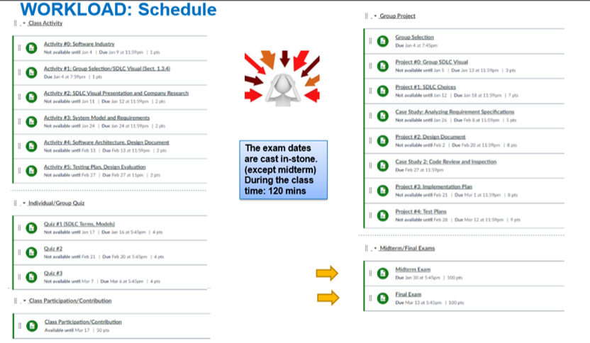

Topic 1: Introduction
===
#### Winter 2017

Dr. Arnold (Arnie) Lund
---

---
2 Today…
---

<ul>
  <li>Meet Me:  Who am I? What do I do?</li>
  <li>Meet You:  Who are you, and what do you want to do here?</li>
  <li>Meet the Course:  What is this course about?  Course Structure and Logistics</li>
  <li>Meet Software Engineering</li>
</ul>

---
3 
---

##### Extra Slide Notes

<ul>
  <li>Social justice as special sauce…</li>
  <li>Diversity for ideation</li>
  <li>Maximizing customer market (e.g., localization)</li>
  <li>Platform trends</li>
</ul>

---
4 
---

---
5
---

---
6
---

---
7 
---

##### Extra Slide Notes

<ul>
  <li>Small Devices</li>
  <li>Integrated into Partner Devices (e.g., Sonos)</li>
  <li>Mobile Devices like Car</li>
  <li>Eventually Expect Robotics</li>
  <li>API using for Industrial Applications</li>
</ul>

Cloud Backend, Improving Speech Recognition Quality and Effectiveness
Federated Skills to Other Service Providers

---
8
---

##### Extra Slide Notes

<ul>
  <li>Waterfall</li>
  <li>Agile and Paired Programming</li>
  <li>Lean</li>
  <li>Wagile</li>
</ul>

---
9
---
cats

---
10 MY LEARNING, TEACHING AND WORK PHILOSOPHY
---

<ul>
  <li>Ground in the real world</li>
  <li>Do and experience</li>
  <li>Diversity and collaborative insight creation</li>
  <li>Prepare to navigate your career
    <ul>
      <li>Learn to speak the language</li>
      <li>Learn to uncover the rules of the game</li>
    </ul>
  </li>
</ul>

---
11 How many of you have shipped commercial software before?
---

---
12 STANDUP PANEL
---

<ul>
  <li>Where?</li>
  <li>What did you work on?</li>
  <li>What was your role?</li>
  <li>Type of development process?</li>
  <li>What was fun?</li>
  <li>What was frustrating?</li>
  <li>What was unexpected?</li>
</ul>

---
13 EXERCISE: What do you want from this course?
---

<dl>
  <dt>Affinity Exercise</dt>
  <dd>5 minutes: Write down out input (1 per post-it, =<3 per person)</dd>
  <dd>5 minutes: Place on white board, close to similar ones (if there)</dd>
  <dt>Survey</dt>
  <dd>Extra credit</dd>
  <dd>Will be open until the end of next week</dd>
</dl>

---
14 Introduction to css 360
---

---
15 COURSE CATALOG DESCRIPTION
---

Surveys the software engineering processes, tools, and techniques used in software development and quality assurance.
 
Topics include life-cycle models, process modeling, requirements analysis and specification techniques, quality assurance techniques, verification and validation, testing, project planning, and management.

---
16 WHERE IT FITS IN CSS
---

How to think and act like CS professionals:
<ul>
  <li>Management Perspectives and Skills ()</li>
  <li>Software Engineering
    <ul>
      <li>Process, Requirements, Design</li>
      <li>Social and Professional Issues</li>
      <li>Ethics, History, Applications</li>
    </ul>
  </li>
  <li>Algorithmic Thinking and Software Development
    <ul>
      <li>Analysis and Design ()</li>
    </ul>
  </li>
  <li>Computer Science (HW, SW)</li>
</ul>

##### Extra Slide Notes

Not development per se
Note:  Transferable for successful careers, learning how to learn the rules of the game

---
17 COURSE LEARNING OBJECTIVES AND OUTCOMES
---

<ol>
  <li>Be able to define and describe software development projects, lifecycle methods, roles, and practices.</li>
  <li>Be able to compare and contrast classical and agile development processes.</li>
  <li>Be able to use knowledge about the software process and software engineering practices to select and justify approaches to use given a project, its teams, and its constraints.</li>
  <li>Be able to examine trade‐offs between software engineering techniques and methods.</li>
  <li>Be able to work with a team on creating software artifacts or work products.  - Communication and Collaboration!</li>
  <li>Be able to describe the ethical responsibilities of software engineers.</li>
</ol>

---
18 SYLLABUS, STRUCTURE AND SCHEDULE
---

“Hands-on” class:  Combination of lecture, group work, and exams

##### Extra Slide Notes

Working with the other faculty to tweak in real-time to share best practices and pivot as needed.

My goal is for you to get these core objectives, and so I’ll adapt as needed to make sure that happens.

---
19 OF NOTE
---

<ul>
  <li>Syllabus and Schedule will Evolve</li>
  <li>Focus on Reading Check-ins, and prepare for class discussion</li>
  <li>Icon Coding and Supplemental Content</li>
  <li>Group Project – Software Engineering Simulation
    <ul>
          <li>Class Time + Outside</li>
          <li>360 Process</li>
    </ul>
  </li>
  <li>Individual Research Project</li>
  <li>Importance of a Personal and Team Workback Schedule
    <ul>
      <li>Discussion Forum</li>
      <li>Class Q&A</li>
    </ul>
  </li>
</ul>

![Know the terminology used on this slide]

---
20 CLASS ATTENDANCE AND THE BOOK
---

Topics covered in class are not necessarily in the book
Other reading materials assigned
Class time focusing on the core ideas
The book has detail, and key is to know when and where to find it
Come to class prepared to discuss what you have read

---
21 
---

---
22 OTHER EXPECTATIONS
---

Students are expected to spend an average of 10 to 15 hours a week outside of class time for CSS 360.
All University of Washington students are expected to conduct themselves as responsible members of the academic community. Among the standards of conduct for UW students includes the responsibility to practice "high standards of academic and professional honesty and integrity."  WAC 478-120-020(2) (a).
Please read the student conduct code at:
http://www.uwb.edu/academic/policies/academic-conduct

---
23 IN THE CLASSROOM
---

If you attend class, please pay attention to the class.
If you want to pay attention to other things, please go elsewhere.
Please be respectful and courteous to others.
No social networking, games, videos, non-class related mobile phone use.
Practice non-violent communication (online and offline).
Cell Phones in airplane mode.

---
24 ADVICE FROM PAST STUDENTS
---

“Keep up with readings and lectures--and you will be fine!”
“A good group dynamic goes a long way.  I really enjoyed my team.”
“STUDY!!!”
“Start the assignments early, even if they seem small. Life can get in the way quite quickly.”
“Don't miss a class.  Discussions contribute as much to the learning process as the slides themselves do.”
“Study in groups for tests is very effective.”

---
25 INTRODUCTION TO SOFTWARE ENGINEERING
---

---
26
---

---
27
---

---
28 CHANGING ROLE OF SOFTWARE
---

Increasing role of software in all systems
Increase of heterogeneous, networked, distributed, interdependent systems
Implications of failure in these systems
Pervasive collection, manipulation, and use of digital data and information
Importance of software and intellectual property to the economy

---
29
---

---
30
---

---
31
---

---
32
---

---
33
---

---
34
---

---
35
---

---
36 EXERCISE:  DEFINE SW ENGINEERING
---

How do you define software engineering?
Write your definition down and discuss this with 1 or 2 of your neighbors in the class.  Do they agree with you?

---
37 EXERCISE
---
Does software programming equal software engineering?  Why or why not?

---
38 CONTRASTS
---

---
39 WHAT IS SOFTWARE ENGINEERING?
---

“A discipline that deals with the building of software systems that are so large or so complex that they are built by a team or teams of engineers” [Ghezzi, Jazayeri, Mandrioli]
“Multi-person construction of multi-version software” [Parnas]
“Software engineering is an engineering discipline that is concerned with all aspects of software production from the early stages of system specification through to maintaining the system after it has gone into use.”  — Sommerville Ch.1

---
40 
---

---
41 
---

---
42 EXERCISE: REFLECTION
---

What questions do you have about software engineering?

Think silently [1 min]
Share with pair [2 mins]

---
43 TYPICAL QUESTIONS
---

How do you estimate how long something will take?
How do you know who should work on what?
How do you know what needs to be done?
How do you know if you are building the right thing?  The most important thing?
How do you know if you’re building the thing right?
How do you know if what you are working on is “done”?
How do you know what is the most important thing to work on next?
How do you know by when something needs to be done?
How do you know when to no longer support some aspect of a system?
How do you know when to work individually, and when to work in a group?
How do you make the best possible team?
How does the context and environment in which you are operating change the way in which you answer these questions?

---
44 A BRIEF HISTORY
---

Software engineering – late 1960s
Goal is to address the problems of building large software systems
Software crisis - software projects that are over budget, behind schedule and that missed the mark
But this is not a temporary problem, but an inherent difficulty in building new and complex applications 

---
 45
---

---
 46
---

---
 47
---

---
48 EXERCISE: GROUP FORMING
---

4 Students per Group
Please POST on the class discussion board:
One posting per group
Group Name
Names (Last Name, First Name) of Your Group Members
