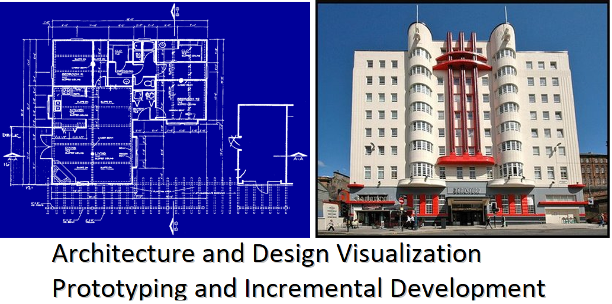
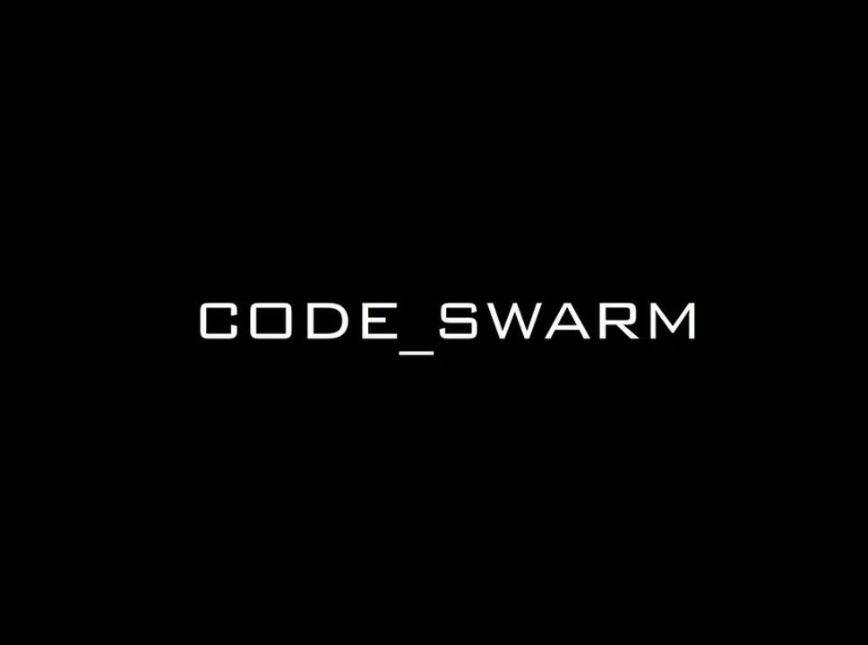
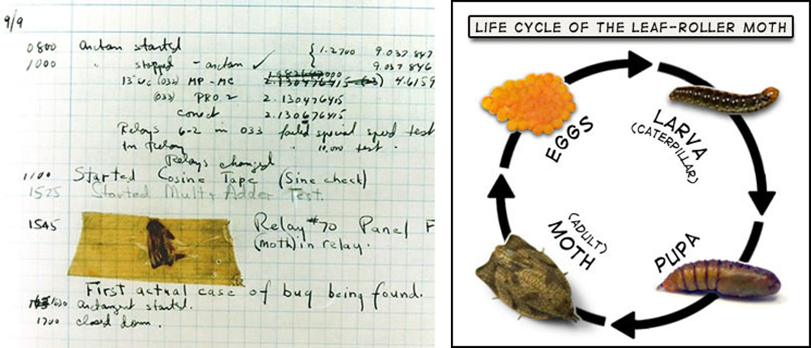
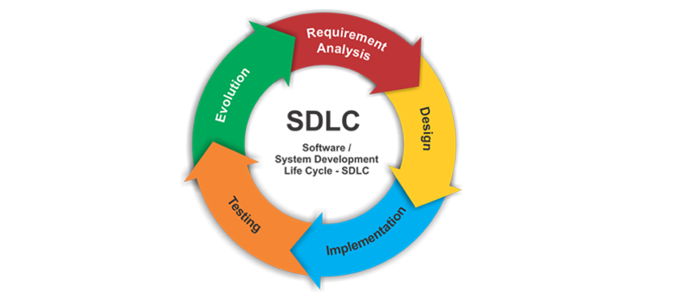
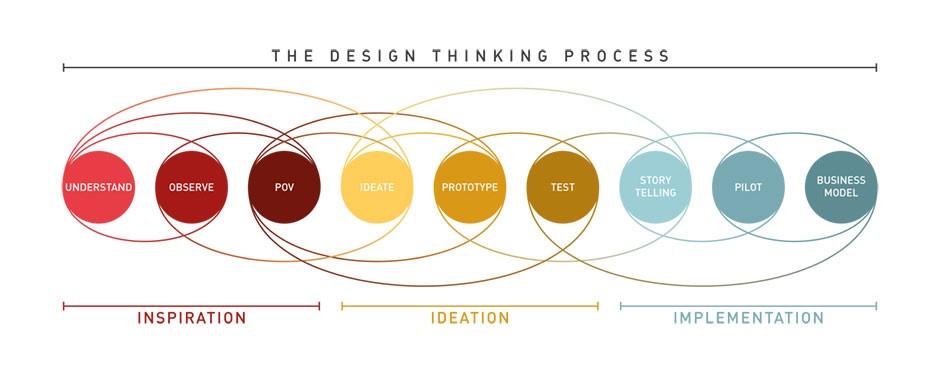
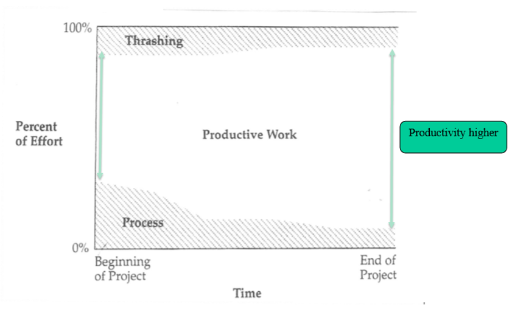
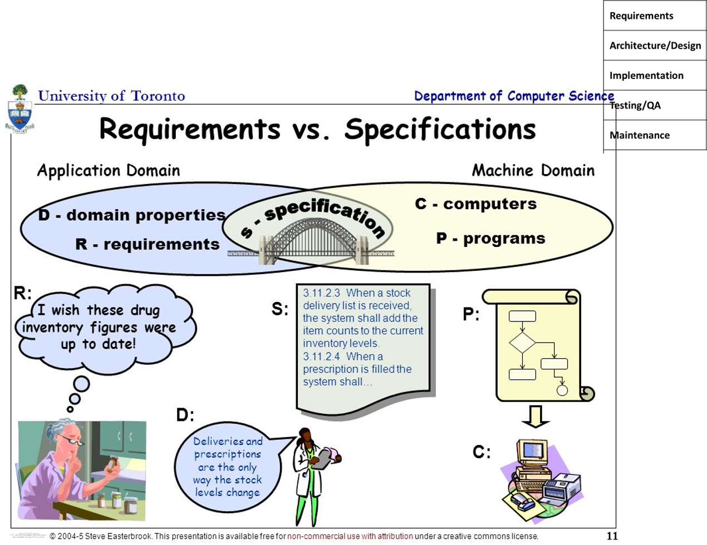
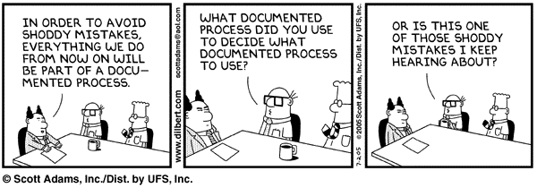

Lecture 3 : System Failure to Development Process
===

Dr. Arnold (Arnie) Lund
---

[Back to Table of Contents](https://github.com/RyanCPeters/Educational_Resources/tree/master/360)

---
2 PUZZLED? And UPDATES
---

- Moving due date for system high level architecture comparison from Wed to Friday of next week
- Adopting a company
  + Interesting dimensions that shape their organization and processes
  + Hint: Think where can learn the most, but also where can get the data
  + Imagining a future product they might offer for future exercises

---
3 Today…
---

- Sources of System Failure
- Software Development LifeCycle (SDLC)

---
4 Discussion: No Silver Bullet
---

- Do you agree with Brooks’ classification of problems (i.e. essential vs. accidental)?
- Do you agree with his argument that there is no silver bullet? Why not?
- 20 years later, might there be a silver bullet on the horizon? Do they attack essential or accidental problems?

#### Extra Slide Notes

Paradigm shift possible? Needed? Timber-built buildings vs. buildings capable of holding elevators.
Steam and reinvention.

---
5 SOFTWARE ERROR EXAMPLES
---

https://www.youtube.com/watch?v=AGI371ht1N8

https://www.tricentis.com/resource-assets/software-fail-watch-2016/

---
6 What interesting examples did YOU find?
---

---
7 Example
---

#### Extra Slide Notes
Not a software flaw, but a hardware flaw that manifests itself through software and that needs to be solved with software.

---
8 Why is it difficult to get error free software systems? (bulb)
---

- Four essential problems
  + Complexity
  + Conformity
  + Invisibility
  + Changeability
- And a bunch of accidental ones, for example:
  + Human error
  + Poor interfaces
  + Inadequate abstractions
  + Lack of solid mathematical/engineering foundation 
  

#### Extra Slide Notes

There are four essential difficulties that make the production of a software product difficult:
We’ll talk about each of these in turn

This and the next slides from Fred Brooks

In lecture, we identified the following. 1) Complexity: no two software parts are alike (or they would be unified into one), and complexity grows non-linearly with size. 2) Conformity: software is required to conform to its operating environment and hardware, which are often out of its control; this burden is especially difficult since software is often used to mask or fix problems in these underlying strata. 3) Changeability: software can change in nearly infinite ways, and can come from many sources: new applications, users, machines, standards, laws, hardware problems, and so on. 4) Intangibility: software has no physical form and therefore is not constrained by physical laws, per se. This also means that there is no natural or obvious representation of what software “looks” like. Software cannot be “observed” in a conventional sense.

---
9 COMPLEXITY
---

- Complexity grows non-linearly with size
  + Scaling-up is necessarily an increase in the number of different elements
  + Interaction between elements varies
- No two software parts are alike
  + If they are, they would be unified into one
  + Compare to buildings and automobiles

---
10 Pictures
---

---
11 Pictures
---

---
12 Pictures
---

---
13 Conformity
---

Software must conform to the existing environment

- Hardware and Software Platforms
- Existing Systems
- Regulations and Standards (e.g., ISO, ADA, HIPAA)
- Corporate Standards

---
14 Invisibility
---

- Software is invisible and unvisualizable
- Compare with floor plan of a building 

- Software is not inherently embedded in space
- Communicating concepts about the software is more difficult

#### Extra Slide Notes
The floorplan of a building helps both architect and client evaluate spaces, traffic flows, views.  Contradictions become obvious.

Multiple hands touching the code of large systems, incomplete testing (inevitable due to complexity)

Are there ways to make it visible?  Architecture.  Prototyping.  Patterns.  Golden thread.
True managers see the results.  They who have the code working win.

---
15 CHANGEABILITY
---

- Manufactured items are infrequently changed 
  + Cars, computers are superseded by later models
  + Buildings, bridges have a high cost of change
- All successful software gets changed/evolves
  + Users want additional functionality
  + Software survives beyond the normal life of the machine for which it was written
  + It is changing faster and faster

---
16 Code Swarm
---

https://vimeo.com/1130828

#### Extra Slide Notes
Eclipse: The open source integrated development environment.
This is a nice visualization, there are others for other big software projects

---
17 INTRODUCTION TO SDLC 
---

#### Extra Slide Notes
September 9, 1945, U.S. Navy officer Grace Hopper found a moth between the relays on the Harvard Mark II computer she was working on. In those days computers filled (large) rooms and the warmth of the internal components attracted moths, flies and other flying creatures. Those creatures then shortened circuits and caused the computer to malfunction.
The term ‘bugs in a computer’ had been used before, but after Grace Hopper wrote in her diary “first actual case of bug being found” the term became really popular, and that’s why we are still using it today.

Portions taken and adapted from Richard N. Taylor (UCI), Nenad Medvidovic (USC),
Hans Van Vliet Software Engineering Principles and Practice, Fred Brooks  No Silver  Bullet,
and from Ghezzi C. et. al. Fundamentals of Software Engineering, 2nd ed., 2003, Prentice Hall

---
18 THE SOFTWARE PROCESS (Sommerville)
---

| Business Case | Defining the product and market |
|:-------------:|:-------------------------------:|
| Specification (v) | Defining what the system should do |
| Design and Implementation | Defining the organization of the system and implementing the system |
| Validation | Checking that it does what the customer wants |
| Evolution | Changing the system in response to changing customer needs |

---
19 SDLC graphic
---

---
20 LIFE CYCLE OVERVIEW (bulb)
---

| Requirements Analysis and Specification | Find out what the customer wants and decide what will be developed |
|:-----:|:-----:|
| Architecture and Design | Plan how to build the system to meet requirements |
| Implementation | Execute your plan |
| Testing/QA and Validation | Check if you conformed to your plan (verification) and if you met customer expectations (validation) | 
| Deployment and Maintenance | Ongoing changes to the system |
| Repeat (Evolution) | |

---
21 Design Thinking Process (bulb)
---

---
22 BENEFITS OF A LIFECYCLE APPROACH
---

- It provides a **structure** for organizing work
- It forces thinking about the "**big picture**” and following steps to reach it without glaring deficiencies
- It helps **avoid local optimization** (individually on target, but collectively misdirected)
- It is a **management tool**

**Cons**

- Change happens

“…I have always found that plans are useless, but planning is indispensable.” – D. D. Eisenhower

---
23 IMPACT OF LITTLE ATTENTION TO PROCESS 
---

---
24 IMPACT OF EARLY FOCUS ON PROCESS 
---

---
25 IT STARTS WITH A VIABLE, FEASIBLE, AND DESIRABLE VISION
---

#### Extra Slide Notes
Note we will talk a bit more about what innovation looks like when we get into requirements, and discuss the Kano model

---
26 USER AND PRODUCT REQUIREMENTS TO SYSTEM SPECIFICATIONS (bulb)
---

#### Extra Slide Notes

Note requirements walkthroughs at Bell Labs, and the problem intended to solve.

Clarify all aspects of the problem.  What input data?  Who will use it?  To do what?  In what context?  What user interface?  What level of error handling?

Will be diving deeper into requirements.

---
27 4+1 MODEL OF ARCHITECTURE (bulb)
---

##### Searchable text boxes from image:
- Shows key abstractions as objects or object classes.
- Shows how, at run-time, the system is composed of interacting processes.
- Shows how the software is decomposed for development.
- Shows the system hardware and how software components are distributed across the processors in the system. 

---
28 MS IT EXAMPLE (logical)
---

---
29 GE PREDIX ARCHITECTURE EXAMPLE (hybrid, high level)
---

---
30 ENABLING SERVICE ARCHITECTURES
---

#### Extra Slide Notes

Note Rich vs. Reach experiences as this connects with hardware

---
31 SYSTEM DESIGN
---

---
32 MODULES (or components)
---

- Design modules before coding
  + Module interfaces specified: functions that are to be called
  + Relationship between modules
  + Include pre-conditions and post-conditions
- Modular design principles
  + Re-use
  + Loosely coupled
  + More (to be discussed later…)

---
33 IMPLEMENTATION (aka Coding) NOTES
---
- Coding is a relatively minor (but still critical) “phase” of the end-to-end cycle (esp. since it is reasonably well defined)
- Good coding style and appropriate comments reduce possible errors and make modification easier
  + Use descriptive variable names
  + Use proper indentation in the loop and if-then interiors
  + Insert blank lines between distinct functions, between code blocks, etc.
  + Remove redundant code
  + Use functions for identifiable and recurring tasks
  + Avoid tricky codes
  + Adhere to consistent coding style

---
34 Top 4 Software Development Best Practices
---

---
35
---

---
36
---

---
37
---

---
38 COSTS ACROSS THE PROCESS
---

#### Extra Slide Notes

Note user experience example, with architecture early and details later.  Prototyping and context, and predictability.

---
39
---

#### Extra Slide Notes

Note Deming and Juran (culture of teams, 80-20 rule, useful many vs. vital few)

---
40 INTRO TO PROCESS TYPES
---

---
41 SDLC PROCESS MODELS (bulb)
---

A software life cycle model is a high level process

<ol>
  <li>Code-and-Fix (or Build-and-Fix)</li>
  <li>Waterfall Model</li>
  <li>Sashimi</li>
  <li>Kanban</li>
  <li>Staged delivery</li>
  <li>Spiral Model</li>
  <li>Spiral into waterfall</li>
  <li>Evolutionary prototyping</li>
  <li>eXtreme Programming (XP)</li>
  <li>SCRUM</li>
  <li>Lean</li>
  <li>Unified Process or Rational Unified Process</li>
  <li>DSDM</li>
  <li>Etc.</li>
</ol>

#### Extra Slide Notes
Need to check toc of Pressman’s book

Add the V-Model?

---
42 MODEL CATEGORIES (bulb)
---

- Prescriptive Models (e.g., Waterfall) – “heavyweight”
  + Aka “planned” approach
  + An ordered approach to the software process with a defined structure and expected set of activities and work products
  + Promote controls that improve project acceptance, decision making, and project management
- Agile Models – “lightweight”
  + Simpler to learn
  + Adaptive software processes
  + Emphasize unique aspects of software development
  + Underlying social values or constructs

#### Extra Slide Notes
We can categorize the various models into two groups:

1. Prescriptive model, they are considered heavyweight approaches because of the highly structured process that the engineers follow.  
2. Agile models.  They are considered lightweight because there is minimal structured process that must be followed.

---
43 PLAN-DRIVEN vs. AGILE
---

---
44 Analysis of SDLC Models
---

- Prescriptive Models
  + Waterfall Model
  + Spiral Model
  + Sashimi
  + Spiral into waterfall
  + Staged delivery

- Agile Models
  + Extreme Programming (XP)
  + Scrum
  + Kanban
  + DSDM
  + Lean

- Uncategorized
  + Code-and-Fix
  + Evolutionary Prototyping
  + UP or RUP

---
45 SDLC METHOD ADOPTION
---

#### Extra Slide Notes

http://recruitment.programmedevelopment.com/public/uploads/files/forrester_agile_development_mainstream_adoption_has_changed_agility.pdf

https://www.planbox.com/blog/agile/scrum/research/2013-Study-reveals-Statistics-on-Agile-Market-Share.html 

---
46 Questions?
---

---
47 Next Class/Week
---

- Company Comparison (this Friday)
- Holiday (Yay!) – time to breathe and do good works
- Topics
  + Plan-driven and Agile Methods
- Assignments
  + Reading
    + Sommerville Ch. 3
  + Due
    + FoR3 – Reflections on Reading
    + Activity #1: System Comparison Visual and SDLC Preferences

---
48 ARCHITECTURE EXERCISE
---
#### Activity #1 (Due Next Week)

Description:
 
1.  iLearn and Canvas Comparison - A Digital Learning Environment for Schools
  - Read Section 1.3.4 (A Digital Learning Environment for Schools) on Sommerville pp.24-25.
  - Compare and contrast this iLearn system with the UW Canvas. i.e. identify and describe 3 similarities and 3 differences between iLearn and UW Canvas.
    + 3 Similarities
    + 3 Differences
  - Complete the visual diagram of the UW Canvas architecture, in a similar form given in Sommerville Figure 1.8

2. SDLC Preferences (based on adopted company) 
  - think about the unique characteristics of your company that drive its software engineering culture, and the product space you’d like to explore (potential bonus points for thinking out of the box)
