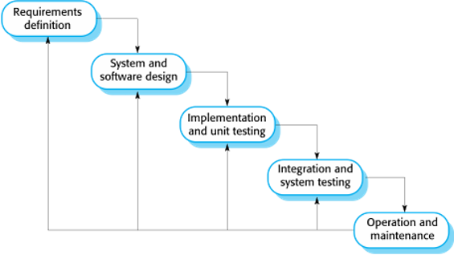
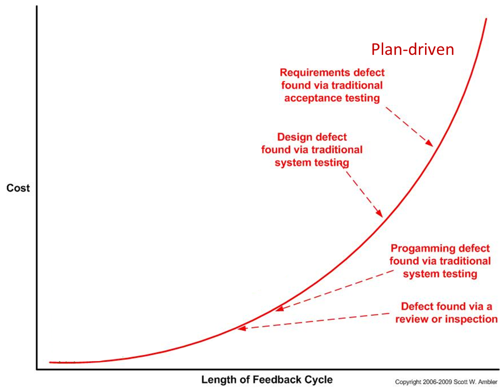
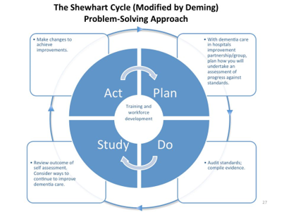
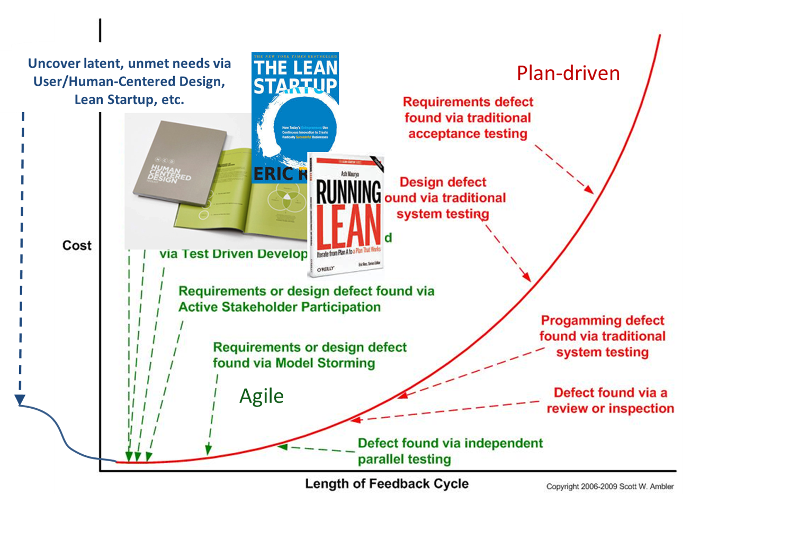
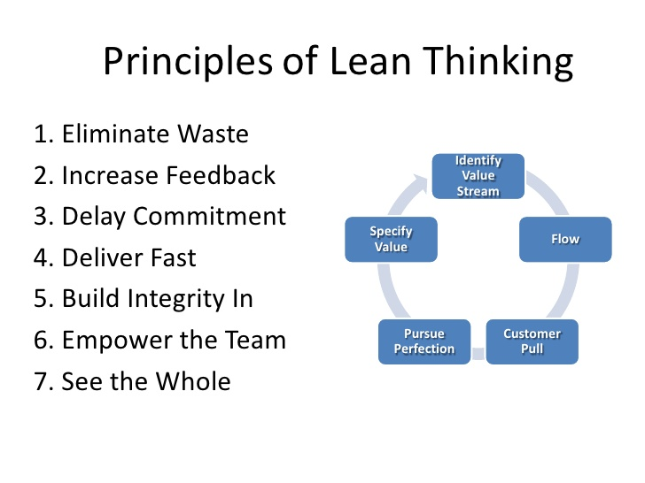

Topics 3 and 4: SDLC, Waterfall and Agile
===

Dr. Arnold (Arnie) Lund
---

[Back to Table of Contents](https://github.com/RyanCPeters/Educational_Resources/tree/master/360)

---
2 PUZZLES & UPDATES
---

---
3 Today…
---

Puzzle Footnote
Plan Driven Process (esp. Waterfall)
Agile Process
Team Work

---
4 Next Stage of Team Project
---

1/8 Company Adoption – done
1/17 Finalize company (in case you want to change), SDLC interest and brainstorm product ideas
1/19 SDLC priorities – due (with system arch comparison exercise)
1/22 Finalize product description, Persona description(s) and exchange by 1/24
1/24 Flesh out Persona persona for other team’s product
1/29 In class requirements interviews
2/5 Analyze data, generate requirements, sketch out scenario, collect observations
2/12 and 2/14 Work on requirements specification deliverable (due 2/16); and product architecture and modules

---
5 SE’S KOBAYASHI MARU PROBLEM (bulb)
---

---
6 PLAN DRIVEN: WATERFALL
---

---
7  Linear Flows
---

---
8 The Waterfall Model (bulb)
---

---
9 Waterfall Planning 
---

---
10 Waterfall Attributes
---

---
11 CHALLENGES?
---

Customer
“They ask me what I want.  I have to figure out exactly what I want, right now.  
If I forget anything, they charge me a lot of money to add it to the list of things I want.
Two years later they give me a program that does some of what I said I wanted. The program doesn’t do some really obvious things (e.g. tabs between fields).
They charge me a lot to add those things, and the rest of the things I really need (now).”

Developer
“They give me a big, clumsy document with imprecise and self-contradictory instructions which are either overly detailed or hopelessly vague.  They ask me how long it will take.  I tell them, and they tell me it has to take less time than that.  That’s nonsense!
I write software that does what the document sort-of says.  Two months later, QA sends me a big list of bugs.  
The customer hates it. The boss is mad at me for building what the document said. Marketing and customers are crazy.”

---
12
---

---
13
---

---
14
---

---
15
---

---
16
---

---
17
---

---
18
---

---
19 COST OF CHANGE (bulb)
---

#### Extra Slide Notes
From http://www.agilemodeling.com/essays/costOfChange.htm

What are the implications of this for planning, prototyping and testing?
Why do you think the curve looks like this? Think the construction of a building and once the foundation is laid, and once the structure is built, etc.  The longer you wait the more constrained (cost effectively) the changes that can be easily made.

---
20
---

---
21 WATERFALL MODEL SUMMARY
---

- Assumptions: “mostly used for large systems engineering projects, developed at several sites” 
  + Future is knowable
  + Cost of change increases dramatically with time
  + Possible to document all essential characteristics
  + Different teams do each step
- Results/Outcomes: “The Plan is King”
  + Document-centric
  + Success measured at handoff
  + Attempt to minimize changes, and minimize communication between people across different stages
  + System barely used until near end (alpha and beta)

#### Extra Slide Notes
Microsoft organizational note, different kind of accountability since people move on
AT&T, walkthroughs inserted; challenge was “independent” platform team(s) [Similar to Office vs. Windows]

---
22 FOOTNOTES (bulb)
---

- What goes in, doesn’t necessarily come out (without extra process)
- Observation: Waterfall is structurally adversarial
  + Change requests cost money
  + Documents may be used to shift costs to “the other guy”
  + Zero-sum games can create challenging working environments
  + Over time, pressure is on incremental improvement; constrained by previous development
- Process Improvement: Software 6 Sigma

#### Extra Slide Notes
Implications for team and organizational functioning
Meta-processes like requirements walkthroughs and sign-offs

---
23 ESTIMATION CHALLENGE
---

---
24 
---

---
25 ESTIMATING AND THE FUTURE
---

---
26 THINKING ABOUT UNCERTAINTY
---

---
27
---

---
28
---

---
29 Estimating
---

---
30 AGILE
---

---
31 Manifesto for Agile Software Development (bulb)
---

- **Individuals and interactions** over process and tools
- **Working software** over comprehensive documentation
- **Customer collaboration** over contract negotiation
- **Responding to change** over following a plan

#### Extra Slide Notes
Source: http://agilemanifesto.org/ 

“That is, while there is value in the items onthe right, we value the items on the left more.”

They emphasize the individuals on the team and the interactions between developers, rather than be guided by processes
They would rather spend time to get a working software, rather than a comprehensive documentation
They would rather have the customer be part of the team, rather than negotiating a formal contract with them
They would rather respond to change, rather than following a plan that may no longer apply

---
32 
---

---
33 AGILE PROJECT MANAGEMENT
---

Evolutionary
Modular
Time-Based
Simple
Rapid Feedback

Stakeholders
Changing Requirements

---
34 SCRUM KEY TERMINOLOGY (bulb)
---

- Development Team
- Product Owner
- Scrum Master:
  + Responsible for ensuring that the Scrum process is followed and guides the team in the effective use of Scrum
- Scrum:
  + A daily meeting of the Scrum team that reviews progress and prioritizes work to be done that day
- Sprint:
  + A development iteration. Sprints are usually 2-4 weeks long.
  + Sprint 0 is a planning sprint.

---
35 
---

---
36 SCRUM
---

Focuses on managing agile iterative development
Three Phases in Scrum:
Outline Planning:
To establish the general objectives for the project and design the software architecture. 
A series of sprint cycles:
Each cycle develops an increment of the system. 
The project closure phase:
Wraps up the project, completes required documentation such as system help frames and user manuals and assesses the lessons learned from the project.

---
37 AGILE SDLC EXAMPLE
---

---
38
---

---
39
---

---
40
---

---
41
---

---
42
---

---
43 Cost of Change Over Time
---

---
44 Waterfall vs Agile ROI
---

---
45
---

---
46
---

---
47
---

---
48
---

---
49
---

---
50 Survey at Microsoft
---
####  For your interest…
Interviews and surveys 2006-2012
Roles:
Developers – 46%
Testers – 32%
Project Managers – 19%
Others – 3% - responses not included

---
51 Survey at Microsoft
---

Those who use agile techniques like the techniques
Perceived benefits of agile (ranked across different roles):
Improved communication
Awareness of other people’s work
Less process overhead – least perceived benefit

---
52 Survey at Microsoft
---

Perceived problems with agile (rank varies across roles):
Incorrect practices of agile
Distributed development
Scalability
Process overhead, sprints too short – least problematic 

---
53 Survey at Microsoft
---

Tools – controversial topic (not typical for Agile, but baked into MS Dev tools)
Individuals and interactions over process and tools [Agile Manifesto]
Usage of tools at Microsoft necessary – large team sizes (thousands), distributed development

---
 54
---

---
 55
---

---
 56
---

---
 57 Cost of Change Over Time: LEAN
---

---
 58 Rule of 10 (bulb)
---

---
 59 Principles of lean Thinking (bulb)
---

<ol>
  <li>Eliminate Waste</li>
  <li>Increase Feedback</li>
  <li>Delay Commitment</li>
  <li>Deliver Fast</li>
  <li>Build-in Integrity</li>
  <li>Empower the Team</li>
  <li>See the Whole</li>
</ol>

---
 60
---

---
 61
---

---
 62
---

---
 63
---

---
 64 CSAT
---

