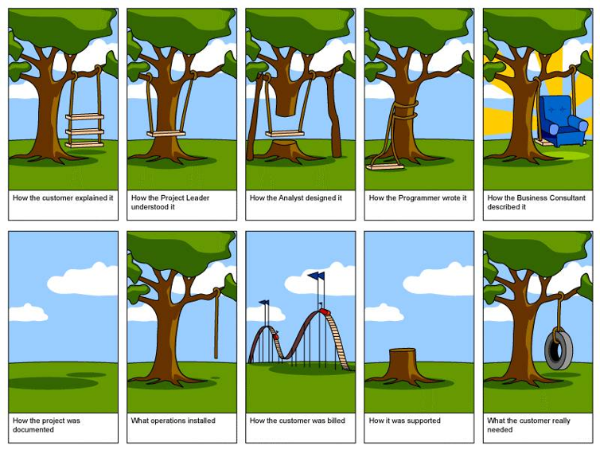
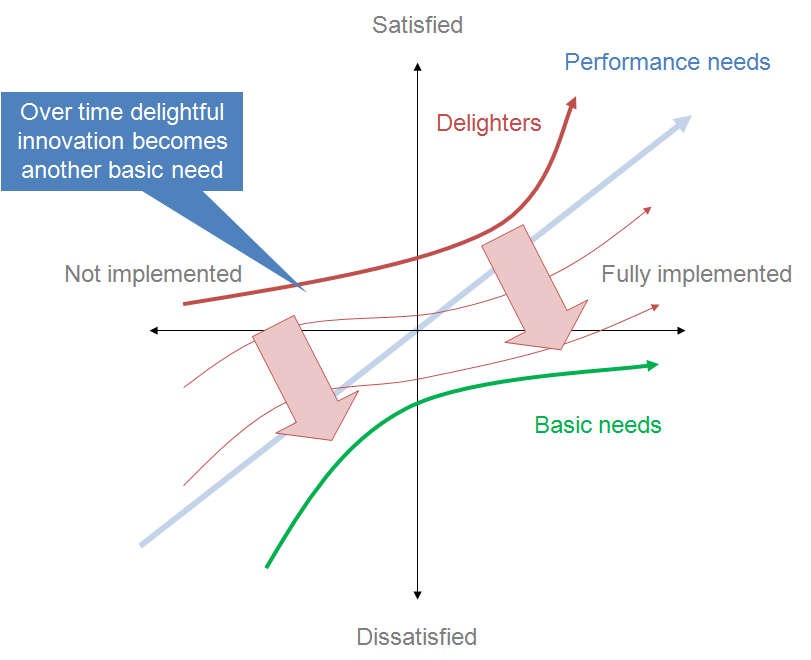
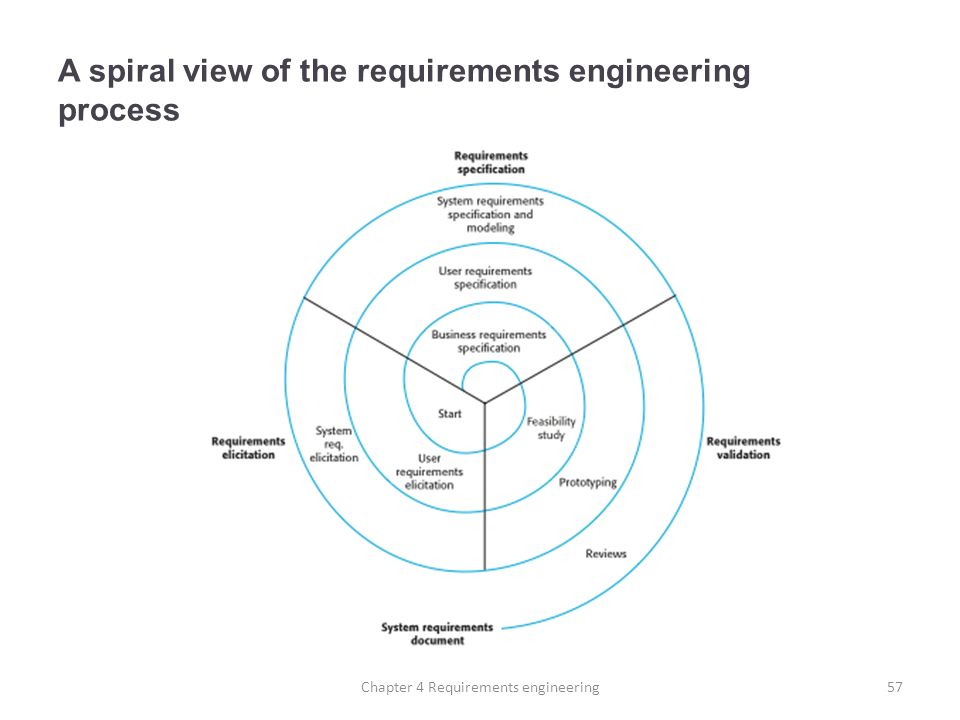

Lecture 5: Requirement Design
===

Content by: Dr. Arnold Lund
---

[Back to Table of Contents](https://github.com/RyanCPeters/Educational_Resources/tree/master/360)

---
3 Today…
---

- Requirements Intro
- Quiz
- Team Work

---
4 Next Stage of Team Project
---

- 1/8 Company Adoption – done
- 1/17 Finalize company, SDLC interest and brainstorm product ideas - don
- 1/19 SDLC priorities – done
- 1/22 Finalize product description, Persona description(s) and exchange by 1/24
- 1/24 Flesh out Persona persona for other team’s product
- 1/29 In class requirements interviews
- 2/5 Analyze data, generate requirements, sketch scenario and storyboard, collect observations
- 2/12 and 2/14 Work on requirements specification deliverable (due 2/16)

---
5 REQUIREMENTS INTRO
---
blank slide

#### Extra Slide Notes

Portions taken and adapted from M.Kochanski, Ian Sommerville’s  Software Engineering  9th  edition  

---
6 SYSTEM DEVELOPMENT COST DRIVERS
---

---
7 ANALYSIS & REQUIREMENTS
---

Also known as:

- Requirements engineering
- Requirements analysis
- Specification or Specs
- Systems analysis
- Structured analysis
- Object-oriented analysis

---
8 Requirements
---

Know thy user, and YOU are not thy user!

---
9 Reqs. Contd. (bulb)
---

- Everything that must be true about the software in order for it to be acceptable
- And nothing else
- “What” but not “how”

**Where can they come from?**

#### Extra Slide Notes

Class discussion in teams.  Then across class.

And nothing else – impt to define the boundary
Focus on what needs to be done, what is the problem, instead of how it will be done

---
10 Reqs. Contd.
---

- What the users require, and nothing else

### Iso 9000 defines requirement as:
"A requirement is a need or expectation that is stated, generally implied or obligatory"

#### Requirement
>A requirement is a need, expectation, or obligation. It can be stated or implied by an organization, its customers, or other interested parties. A specified requirement is one that has been stated (in a document for example), whereas an implied requirement is a need, expectation, or obligation that is common practice or customary.

>There are many types of requirements. Some of these include customer requirements, quality requirements, quality management requirements, management requirements, product requirements, service requirements, contractual requirements, statutory requirements, and regulatory requirements. – ISO 9000 2015 Definitions in Plain English - Praxiom

ISO 9000 is a set of international standards on quality management and quality assurance developed to help companies effectively document the quality system elements to be implemented to maintain an efficient quality system.

#### Extra Slide notes
Note shall vs. should in ANSI

---
11 Misunderstandings
---

---
12 The Waterfall Model
---

- Requirements definition
  - System and software design
    - Implementation and unit testing
      - Integration and system testing
        - operation and maintenance

---
13 Kano Model (bulb)
---

---
14 Terms
---

- Requirements _analysis/engineering_
  + Activity of unearthing a customer’s needs
- Requirements **specification (aka specs, often but not always)**
  + Document describing your customer’s needs

- The descriptions of the services that a system should provide and the constraints on its operation, reflecting the needs of customers for a system (Sommerville, Ch.4)
  + User Requirements:
    + Statements of what services the system is expected to provide, and the constraints
  + System Requirements:
    + More detailed descriptions of the software system’s functions, services, and operational constraints

#### Extra Slide Notes

Note the Customer is not necessarily the User, and it can be important to identify and distinguish the different sets of requirements.

- Requirements specification
  + Document describing a customer’s needs

---
15 Requirement: Analysis-Discovery-Engineering
---

| "As a/an" (who) | "I want to..." (what) | "So that..." (why) |
|:-----:|:-----:|:-----:|
| Store Owner | Recieve an email when a customer submits an order | I can print the order, so it's ready to be filled |
| Customer | Be able to place an order for a quantity of widgets | I can fill my desire to own lots of widgets |
| Customer | View a history of orders I've placed. | I can print these out for tax purposes, and get an idea f my widget consumption over time |

#### extra slide notes

Why the why? Prioritization.

---
Requirements Specification
---

Process of "writing down" the user and system requirements in a requirements document. Specification helps avoid "ambiguity."

- `User requirements` are defined as: 
  - Statements, in a natural language plus diagrams, of what services the system is expected to provide to system users and the constraints under which it must operate. The user requirements may vary from broad statements of the system features required to detailed, precise descriptions of the system functionality.
- `System requirements` are defined as:
  - Written in natural language, but also in formalized documentation languages. eg., UML
  - Detailed descriptions of the software system’s functions, services, and operational constraints. The system requirements document (sometimes called a functional specification) should define exactly what is to be implemented. It may be part of the contract between the system buyer and the software developers.

---

User Req. Examples
---

On the first try, within 15 minutes, 75% of govt employees should be able to figure out system.
-
-

---

System Req Examples
---

- Processes
  +Exampes:
    - The student records...
    - sd
- Performance
  + Examples:
    -
    -

---

Business, domain, Regulatory, and other Reqs and Constraints
---

---

Requirements Exercise
---
Group exercise:

- Pair up and decide who is person A and who is person B
- Take 5 minutes to think about:
    + Person A: You will be imagining an AI-based Intelligent tutor
    + PersonB: you will be imagining an AI-based "guide dog" device for a blind person
- Now:
  + Person A interview person B for 5 minutes on what they want
  + Person B interview Person A for 5 minutes on what they want 
- Take 5 minutes to write down a set of user and system reqs

I am person B:
- User Reqs:
  + Must be conveniently portable
    * ie, should not be bigger than my phone.
    * should be reasonably descrete
    * should also have a means to declare or show to people around the user that they are being guided.
  + Must be able to record and track users surroundings without making their sensitive info insecure. 

Interviewing person A:
- Should be able to direct student to correct informational reference and location in that material for any given subject related question
- Accurately tell the student if their answer was correct
  + if wrong, give step-wise feed back on how to correctly solve
  + give source material references for where to go study up on the material related to said question
- must be able to handle voice or text input
  - needs to provide integration api for easy adaptation to systems like Canvas. 

---

Shall is not Should
--

very specific slide that just clarifies the title

---
Functional Requirements
---

Describe the functionality or services that the system is expected to provide.

Examples:

-"The user ***shall*** be able to search either all of the initial set of databases or select a subset from it"
- missed it

then a table

---
functional reqs contd.
---

Big blob of text here

***Challenges***

- Making precise - ambiguous requirements may have different interpretations.
- achieving completeness
  + completeness - all services requres by the user should be defined.
- achieving consistency 
  + consistency - requirements should not have contradictory definitions.

---
Non-functional Reqs
---

- Requirements that are not directly concerned with specific functios, but relate to emergent system properties, such as reliability, response time, security, etc.
- May be more critical than a functional req
  + if a functional req is not satisfied, users can find work-arounds
  + but if a non-functional req , eg reliability, is not met -> sysem becomes unuseable
    - Aircraft system does not meet reliability req -> unsafe to use

---
non-functional requirements table
--
 <!--- image of different non-functional reqs -->

---
missed slide
---

#### Hint: Sometimes can transofrm non-functional into functional properties

- Another approach is 
- missed

---
Practice
---

- All text must be red.
  + Non-functional
- 90% of novice user can learn to operate major use cases without outside assistance
  + non-func
- screen 1 can print on screen data to printer
  + functional
- members of the data entry group can enter requests but can not approve or delete requests
  + functional
- field 2 only accepts dates before the current date.
  + functional
- the database will have a functional audit trail.
  + functional
- the system must adapt to changes in any input record format without the 
  + non-functional?

---
practice contd.
---

- the spreadhseet can secure data with electronit sigs
  + functional
- all menus must have a consisten format
  + non-func
- the mean time to change data presentation (no new data entities) will be <1 person-onth for a senior system developer
  + non-func
- Dr. Cerf shall be satisfied with the user interrace
  + nonfunc
- the system will limiit acess to authorized users.
  + functional
- the displayed clock rate must be within 5h of actual clock rate.
  + non-func
- clicking the approve button moves the request to the approval workflow
  + functional
- the product can switch between english and metric units without recompiling nor rebuilding the program.
  + non-functional

---
Requirements Engineering Process (Spiral View)
---

 <!--- Spiral diagram as was in textbook, between 4.1 and 4.3 -->

---
Feasibility study
---

- A feasibility study decides whether or not the worthwhile proposed system is doable
- checks whether
  + system contributes to organizational objectives
  + system can be engineerd using current technology and within budget
  + system can be integrated with other systems that are used
  + define scope (what features do we ***NEED*** to implement)

---
Complicating res: constraints
---

 <!--- uml image of common examples -->

- Limitations on the design or on the project itself
  + the system shall be written in c++
  + the system must be installed and operational by april 15th
- Constrains may be changed arbitrarily by the management,( alas, just the way it is, they're the boss )

---
Title less slide with books images
---

maybe many images, maybe one...  dunno yet.

---
Team Time
---

- Write down the name of your team and the team members.
- Write down your product name and a paragraph description of your big idea and what the product is intended to do.
- Write down a description of a typical user for your product, wy you think they would want to use it (their goals and what would cause them to use it), and the context in which you would expect them to use it.
- Submit the completed descriptions to instructor, and by Noon on Wednesday Jan 24, 2017, and bring paper copies to class later that day.

groups fuzzy deicsion for product options
 
- A gameplay recording feature similar to "OBS"
  + OBS is: 

> "Free and open source software for video recording and live streaming. Download and start streaming quickly and easily on Windows, Mac or Linux."

  + we'd be be building an api that allows streamlined incorporation of OBS into steam games, with an external tool for management of content.
