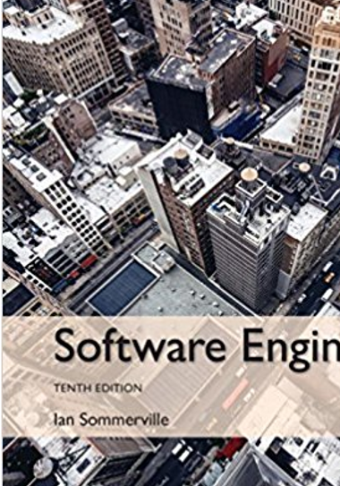
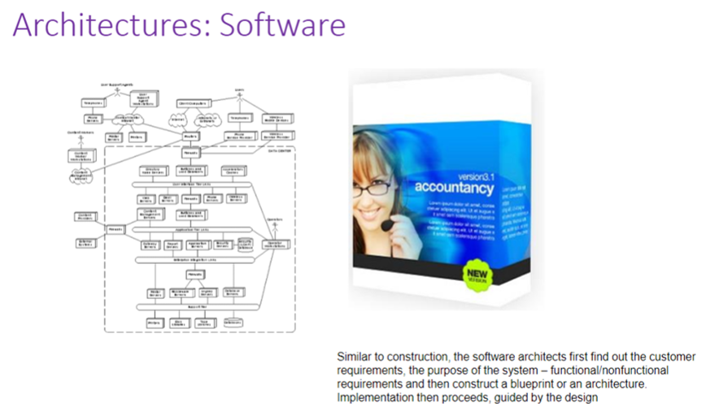
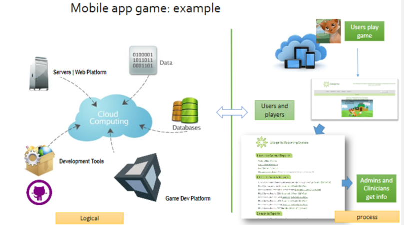
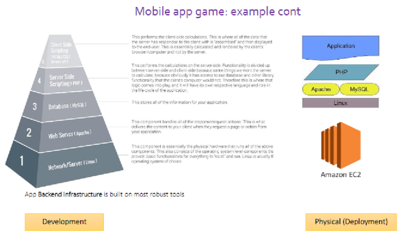
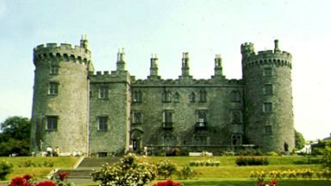
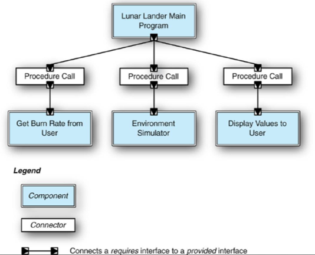

Lecture 8: Architecture Contd.
===

Dr. Arnold (Arnie) Lund
---

[Back to Table of Contents](https://github.com/RyanCPeters/Educational_Resources/tree/master/360)

---
2
---

Questions and Updates

---
3 Today…
---

Architecture Continued
Test Prep and Study Groups

---
4 Next Stage of Team Project
---

- 1/8 Company Adoption – done
- 1/17 Finalize company, SDLC interest and brainstorm product ideas - done
- 1/19 SDLC priorities – done
- 1/22 Finalize product description, Persona description(s) and exchange by 1/24 - done
- 1/24 Flesh out Persona persona for other team’s product – done
- 1/29 Upload Product and User Description – done
- 1/29 More Detailed Project Description (company adopted and why, product/service description, SDLC will use)
- 1/29 In class requirements interviews
- 2/5 Test
- 2/7 Analyze data, generate requirements, sketch scenario, and collect observations
- 2/12 and 2/14 Work on requirements specification deliverable (due 2/16)

---
5 Next Stage of Team Project
---
#### Moving Into Design

- 2/14 10 min In-Class Presentation on status (and slides on 2/13):
    + Company
    + Product concept (and core value proposition for user), and its potential market and Corporate strategic importance
    + SDLC method you’ll be using and why
    + Context or Behavioral model illustration (high level, Ch. 5)
    + Architectural pattern illustration (Ch. 6)

---
6
---

#### What is Design?
  - Creation of a blueprint that solves the problem posed by analysis.
  - Involves the selection of key technologies and/or approaches.
  - Balances realities and practicalities to identify a feasible solution.
  - levels of design activity
    + high level design (architecture)
    + Low level design (detailed design | often overlap with implementation)
      * the devil is in the details

#### Architectural Design
  - Understanding how a system should be organized and designing the **overall structure** of that system.
  - Agile processes -- done in early stage of development.
    + Incremental development of architecture is not usually successful.

---
7
---

---
8
---

---
9
---

---
10
---

---
11
---

   
A collection of architectural design decisions that are applicable to a recurring design problem 

##### Extra Slide Notes
Different styles to serve different purposes

What is the purpose of the house / castle?

The castle was built as a fortress, a protection against enemies.  Thus, you have sturdy concrete walls.
A house is not built for that purpose but for the enjoyment of a family living there.  Thus, you have lots of windows, balcony space and patio space.

---
12
---

What do you think might be examples of architectural patterns in physical buildings?  
Design patterns in consumer products?

##### Extra Slide Notes
_**Pattern**_ in architecture is the idea of _capturing architectural_ design ideas as archetypal and reusable descriptions. The term "pattern" in this context is usually attributed to _Christopher Alexander_,[1] an Austrian born _American architect_. The patterns serve as an aid to design _cities_ and _buildings_. The concept of having collections of "patterns", or typical samples as such, is much older. One can think of these collections as forming a _pattern language_, whereas the elements of this language may be combined, governed by certain rules.

---
13
---

---
14 SOFTWARE ARCHITECTURAL PATTERNS
---
#####  (or styles) – Reference Sommerville

Main program and subroutines
Object-oriented
Layered 
Client-Server
Repository
Model-View-Controller (MVC)
Sense-Compute-Control
…and many others

##### Extra Slide Notes
This will introduce to the basic styles
There are many more architectural patterns

---
15 Main Program and Subroutines
---
##### Call and Return

- Typical uses
  + Small programs
- Caveat
  + Large applications – will not scale

###### Taylor, R.N. et al. Software Architecture Foundations, Theory & Practice

##### Extra Slide Notes
Diagram represents the Lunar Lander game (game popularized in the 1960s.  Object of the game is to land on the moon successfully by controlling your speed of descent and by selecting an appropriate landing spot)

###### Hierarchical

A main program invokes different functions or methods

---
16 Object-oriented
---

---
17 Layered
---

Each layer only relies on the facilities and services of the layer immediately beneath it
Support separation and independence
Typical uses
Operating systems, network protocol
Caveats
Strict virtual machines can be inefficient

---
18 
---

---
19 Middleware
---

Supported by extensions to operating systems such as
OMG Corba/DCE
Microsoft COM/ActiveX/.Net
Javasoft JavaBeans
Internet-related SOAP / WSDL / UDDI

---
20 Client - Server
---

Special case of Layered
2-tiered client-server
3-tiered client-server
Clients use services provided by the servers

---
21 Client - Server
---

Typical uses
Where centralized data or centralized processing is needed
Usually business applications
Caveat
Will not work well when you have a limited bandwidth and there are a many client connections

---
22 Repository / Blackboard
---

Good way to share large amounts of data among interacting components
Components operate around agreed data model

---
23 
---

---
24 
---

---
25 Model-View-Controller
---

Typical uses
Graphical user interfaces
Multiple ways to view or manipulate the data
Caution
If interactions between data model and controller are simple, may have more overhead

---
26 Sense-Compute-Control
---

---
27 Sense-Compute-Control
---

---
28 Sense-Compute-Control
---

Typical uses
Real-time systems
Caveat
Highly subject to environmental conditions
Hardware malfunction (e.g. in sensors) may not be detected and system can enter into an error state 

---
29 Real-Time Systems
---

Systems that direct interact with the environment through sensors and actuators
Systems that require absolute scheduling of tasks rather than pre-emptive and other less deterministic types of multitasking

---
30 BASIC ARCHITECTURAL ELEMENTS
---

Components (computation)
Connectors (communication)
Interfaces (exposed entry &
exit points for components
and connectors)
Links
Configuration (topology)

---
31
---

---
32
---

---
33
---

---
34
---

---
35
---

---
36
---

---
37
---

---
38
---

